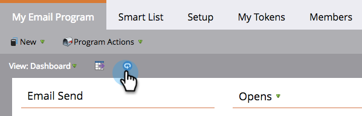

# Use the Email Program Dashboard {#use-the-email-program-dashboard}

Use the Email Program Dashboard - Marketo Docs - Product Documentation

Check out how your [email programs](../../../../../welcome-to-marketo-docs/product-docs/email-marketing/email-programs.md) are performing with this dashboard view.

>[!NOTE]
>
>If your program has an A/B test, check out the [Email Program Dashboard - A/B Test View](../../../../../welcome-to-marketo-docs/product-docs/email-marketing/email-programs/email-program-actions/email-test---a/b-test/use-the-email-program-dashboard-a-b-test-view.md).

>[!NOTE]
>
>All data in this view is aggregate (includes A/B test as well as the final email send).

### What's in this article? {#what-s-in-this-article}

[Email Send](#usetheemailprogramdashboard-emailsend)  
[Opens/Clicks](#usetheemailprogramdashboard-opens-clicks)  
[Summary - Engagement](#usetheemailprogramdashboard-summary-engagement)  
[Summary - Rest](#usetheemailprogramdashboard-summary-rest)  
[Refresh Dashboard](#usetheemailprogramdashboard-refreshdashboard)

#### Email Send {#usetheemailprogramdashboard-emailsend}

Here you can see how many emails were sent, bounced, and delivered.

>[!NOTE]
>
>Due to email deliverability standards that are outside of Marketo's control, Bounced and Delivered stats are approximate, not exact.

#### Opens/Clicks {#usetheemailprogramdashboard-opens-clicks}

This chart shows you the number of emails opened/clicked during specific time periods after the email program was run.

>[!TIP]
>
>Notice how the number of opens/clicks diminishes as time goes by.

#### Summary - Engagement {#usetheemailprogramdashboard-summary-engagement}

This shows you the overall [engagement score](../../../../../welcome-to-marketo-docs/product-docs/email-marketing/drip-nurturing/reports-and-notifications/understanding-the-engagement-score.md).

#### Summary - Rest {#usetheemailprogramdashboard-summary-rest}

The rest of the data will display Opens, Clicks, Click/Open Ratio, and Unsubscribes.

>[!TIP]
>
>The **Unsubscribe** rate in the above example was so small that Marketo zoomed in to give you a better look. The second number within the bar is merely added for scale.

>[!NOTE]
>
>**Definition**
>
>**Opens **are counted when the email recipient downloads the email's images, which includes a Marketo-inserted tracking pixel. If the recipient views the email but chooses not to download its images, that will not count as an open. If the images load in the recipient's preview pane, that will usually count as an open, but it will vary based on the email client.
>
>**Click to Open** measures the percentage of emails that were both opened and had a link clicked in the email. We take the number of unique clicks divided by the number of unique opens, then multiply by 100 to show it as a percentage.

#### Refresh Dashboard {#usetheemailprogramdashboard-refreshdashboard}

To see the most up-to-date data, simply click the refresh icon on the dashboard.

>[!NOTE]
>
>**Related Articles**
>
>* [Use the Email Program Dashboard - A/B Test View](../../../../../welcome-to-marketo-docs/product-docs/email-marketing/email-programs/email-program-actions/email-test---a/b-test/use-the-email-program-dashboard-a-b-test-view.md)
>

