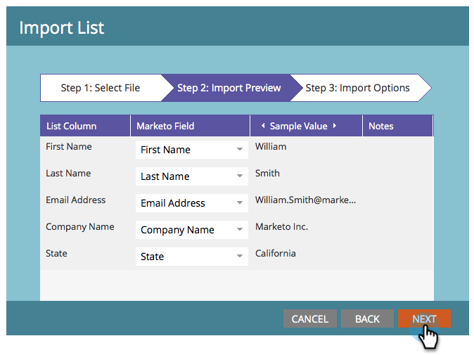

# Define an Audience by Importing a List {#define-an-audience-by-importing-a-list}

Define an Audience by Importing a List - Marketo Docs - Product Documentation

>[!NOTE]
>
>**Prerequisites**
>
>* [Create an Email for an Email Program](../../../../../welcome-to-marketo-docs/product-docs/email-marketing/email-programs/email-program-actions/create-an-email-for-an-email-program.md)
>

Once you've created an email program, you'll want to tell it who to send the email to. You can do this by [creating a smart list](../../../../../welcome-to-marketo-docs/product-docs/core-marketo-concepts/smart-lists-and-static-lists/creating-a-smart-list/create-a-smart-list.md) or by importing a list. Here's how to accomplish this by importing a list. 

>[!NOTE]
>
>Defining your audience will only work when the email program is not approved.
>
>Any date/time fields being imported are treated as Central Time. If you have date/time fields in a different time zone, you can use an Excel formula to transform it to Central Time (America/Chicago).

1. Go to **Marketing Activities**.

   

   ##### Select your email program and then click Import List under the Audience tile. {#defineanaudiencebyimportingalist-selectyouremailprogramandthenclickimportlistundertheaudiencetile}

   

1. The list import window opens, click on **Browse** and select the file you want to import. Once you have selected your list of people, click Next.
1. 

   >[!CAUTION]
   >
   >Make sure the list is encoded UTF-8, UTF-16, Shift-JIS, or EUC-JP, and does not exceed 50MB in file size.

   ##### Verify that the fields in your file are mapped correctly and click Next. {#defineanaudiencebyimportingalist-verifythatthefieldsinyourfilearemappedcorrectlyandclicknext}

   

   >[!TIP]
   >
   >Marketo will remember the mappings for future imports!

1. Enter a **Name** for your list and click **Import**.

   

1. Once the import is done, go back to the main program tab. You'll see how many people will qualify.

   

>[!NOTE]
>
>**Definition**
>
>Did you notice the Blocked number? This number is a subset of the qualified people and represents people that cannot be sent this email because they are:
>
>* Unsubscribed
>* Marketing Suspended
>* Blacklisted
>* Email Invalid
>* Empty Email
>
>Click the number for a detailed list of people blocked from mailings.
>
>Use the  button on the **Audience** tile to see how many people qualified to receive the email based on smart list criteria. Subtract the Blocked number from the People number to get the total number of people who will receive the email.

>[!TIP]
>
>You don't have to wait for the list import to finish. You can keep working if you'd like.

Fantastic! Now it's time to choose an already existing email or to create a new email to send to these people. 

>[!NOTE]
>
>**Related Articles**
>
>* [Choose an Existing Email](../../../../../welcome-to-marketo-docs/product-docs/email-marketing/email-programs/email-program-actions/choose-an-existing-email.md)
>* [Create an Email for an Email Program](../../../../../welcome-to-marketo-docs/product-docs/email-marketing/email-programs/email-program-actions/create-an-email-for-an-email-program.md)
>

