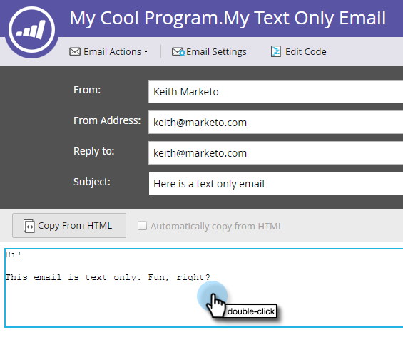

# Add Tracked Links to a Text Email {#add-tracked-links-to-a-text-email}

Add Tracked Links to a Text Email - Marketo Docs - Product Documentation

>[!NOTE]
>
>**Prerequisites**
>
>* [Create a Text Only Email](../../../../../welcome-to-marketo-docs/product-docs/email-marketing/general/creating-an-email/create-a-text-only-email.md)
>* [Edit Elements in an Email](../../../../../welcome-to-marketo-docs/product-docs/email-marketing/general/email-editor-2.0/edit-elements-in-an-email.md)
>

Text email links can be tracked in Marketo. Let's see how it works. 

##### 1. Select your email and click Edit Draft. {#addtrackedlinkstoatextemail-selectyouremailandclickeditdraft}

  

##### 2. Double-click the editable area you want to add the link to. {#addtrackedlinkstoatextemail-double-clicktheeditableareayouwanttoaddthelinkto}

  

##### 3. Enter the URL with double brackets, like this: [[www.domain.com/path/page.html]]. {#addtrackedlinkstoatextemail-entertheurlwithdoublebrackets-likethis-[[www-domain-com-path-page-html]]}

##### 4. Close out of the editor, and don't forget to approve the draft. {#addtrackedlinkstoatextemail-closeoutoftheeditor-anddon'tforgettoapprovethedraft}

>[!NOTE]
>
>The mktNoTok class functionality does not work with trackable links in text emails. Only for HTML emails.

>[!TIP]
>
>Test it out to double-check. Make sure you entered the brackets correctly.

Nice work!  

