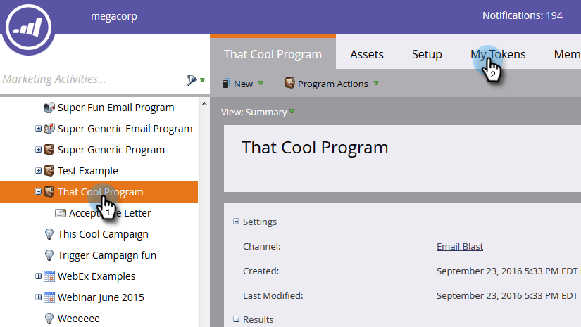

# Using URLs in My Tokens {#using-urls-in-my-tokens}

Using URLs in My Tokens - Marketo Docs - Product Documentation

Follow the steps below to use My Tokens to insert URLs into your emails.

1. Select your program and click **My Tokens**.

   

1. Select the **Text** My Token, drag and drop it onto the canvas.

   

1. Give the token a unique name, enter a URL (without the http://) and click **Save**.

   

   >[!CAUTION]
   >
   >To make sure clicks are tracked in your email, do **not** enter http:// inside the token's value.

1. Select the email in your program.

   

1. Click **Edit Draft**.

   

1. Double-click in the text area to edit.

   

1. Anywhere in your email, type "http://" (without leaving a space after) and click the Insert Token icon.

   

   >[!NOTE]
   >
   >You of course also have the option of entering "https" if your site uses it.

1. Locate your My Token, select it, and click **Insert**.

   

1. Highlight the http:// and token, then press Ctrl/Cmd+X (Ctrl = Windows/Cmd = Mac) to cut the text.

   

1. Highlight the text you want the link to display and click the Insert/Edit Link icon.

   

1. Press Ctrl/Cmd+V to paste the content into the **URL** box and click **Insert**.

   

1. Click **Save**.

   

   And you're done! Your URL will populate after sending, and thanks to you putting http:// in front of the token, it will produce a trackable link.

