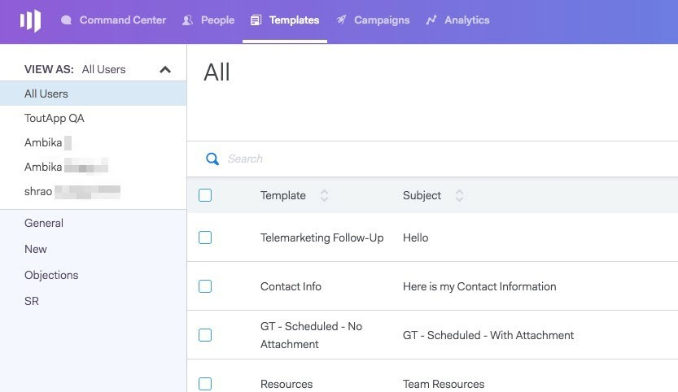
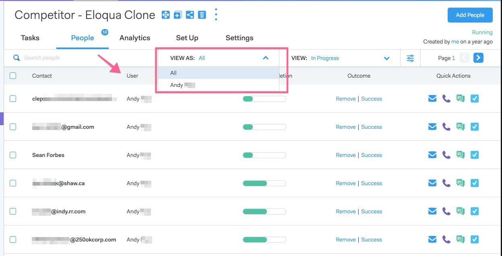
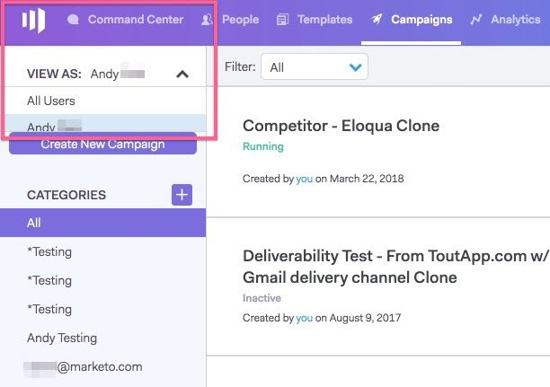

# User Access Details {#user-access-details}

User Access Details - Marketo Docs - Product Documentation

What do Admins and non-Admins have access to?

### What's in this article? {#what-s-in-this-article}

[Admin User Permissions](#useraccessdetails-adminuserpermissions)  
[Non-Admin User Permissions](#useraccessdetails-non-adminuserpermissions)

#### Admin User Permissions {#useraccessdetails-adminuserpermissions}

Admins can [view all templates](http://docs.marketo.com/x/OYAXAQ).

Admins can [view all campaigns](http://docs.marketo.com/x/N4AXAQ).

Admins can [view all email activity](http://docs.marketo.com/x/SYAXAQ).

Admins can see all of the people on a running campaign.

All people records can be accessed in the Everyone group.

Admins can stop campaigns on behalf of users.

#### Non-Admin User Permissions {#useraccessdetails-non-adminuserpermissions}

* Analytics:
* `<li>Users can see team analytics</li>` `<li>Users can drill into just the teams they belong to</li>` `<li>Users can look at their own analytics</li>`

* Relationships Page:

    * Users can share groups with everyone
    * Users can share groups with just the teams they belong to
    * When a user is deleted, their shared contacts transfer ownership to the Master Admin who deleted the user

* Sales Beat - Next and Live Feed:
* `<li>Users can view the ‘everyone’ view</li>` `<li>Users can filter by the team(s) they belong to</li>` `<li>User can share posts with everyone</li>` `<li>Users can share posts with just the team(s) they belong to</li>` 

* Team Management Page:

    * Cannot view

* Templates Page:
* `<li>Users can share templates with everyone</li>` `<li>Users can share templates in categories their Admins allow them to</li>` `<li>When a user is removed from a team, their templates are unshared with that team</li>` `<li>When a user is deleted from a team their templates transfer ownership to the Master Admin who deleted the user</li>`

