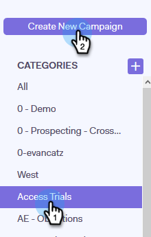
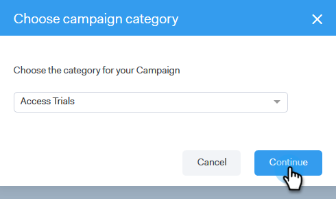

# Create a Campaign {#create-a-campaign}

Create a Campaign - Marketo Docs - Product Documentation

Campaigns are a series of multi-channel steps including: emails, phone calls, InMail, and custom tasks. They allow you to streamline your communications with your potential and existing customers.

With Campaigns you can:

* **Organize**: Streamline all your outreach activities in one place for efficient execution.

* **Scale**: Schedule all your outreach efforts so you can scale your efforts, minimize manual work, and personalize as much as you need.
* **Measure**: Track the success of all your emails and tasks in one place while automatically logging them into Salesforce. By knowing what is resonating and leading to results, you can consistently test and improve your results.

So, how do you set up a Campaign?

1. Click the **Campaigns** tab.

   

1. Select a category and click the **Create a Campaign** button to create a new Campaign.

   

   >[!NOTE]
   >
   >Create a new category by clicking the** +** next to **Categories**.

1. The category you chose will be selected. If you change your mind, click the drop-down and select a different one. When you're done, click **Continue**.

   

1. Click **Add a Step**.

   

1. Choose between: Email, Call, InMail, or Custom Task. In this example we're choosing [Email](http://docs.marketo.com/display/DOCS/Campaign+Step+Types#CampaignStepTypes-Email).

   

1. After you create your first day and step, the "Add a Day" button activates and you can add as many days and steps as your sales process requires.

   

   >[!NOTE]
   >
   >"Days" are not the number of days between actions, but the day within the sequence. For example, if your campaign is going to last 7 days, entering '3' means the action will go out on day 3 of 7, **not **3 days later.

1. Make sure you customize scheduling and reply options, such as skipping weekends (which is awesome) by visiting the **Settings Tab** for your Campaign.

   

   Now it's time to start Adding People to your Campaign!

