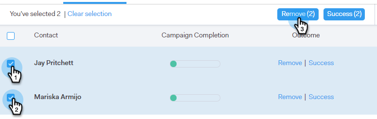

# Remove People from a Campaign {#remove-people-from-a-campaign}

Remove People from a Campaign - Marketo Docs - Product Documentation

You can automatically end a Campaign when a recipient replies. And, you can choose to have that mark the Campaign as a 'success' for that recipient.

To set this up, after you have created your campaign, simply check the Unsubscribe boxes in the Settings portion of the Campaigns tab. Both of these options will end the campaign and your recipient will not receive any more emails from you. You must have reply tracking for this to work.

Additionally, you can remove people from the campaign itself, remove people from a campaign within the People page, and remove an entire group of people. Let's take a look at all three methods below.

### What's in this article? {#what-s-in-this-article}

[Remove a Person Directly from a Campaign](#removepeoplefromacampaign-removeapersondirectlyfromacampaign)  
[Remove a Person from a Campaign Within the People Page](#removepeoplefromacampaign-removeapersonfromacampaignwithinthepeoplepage)  
[Remove a Group of People from a Campaign](#removepeoplefromacampaign-removeagroupofpeoplefromacampaign)

#### Remove a Person Directly from a Campaign {#removepeoplefromacampaign-removeapersondirectlyfromacampaign}

1. In Sales Connect, click the **Campaigns** tab.

   

1. Find your campaign and select it.

   

1. Your campaign appears on the right. Click anywhere on it to open it.

   

1. Find the person you want removed and click **Remove**.

   

1. (OPTIONAL STEP) You can also remove multiple people at once by clicking the checkboxes next to their names and clicking the **Remove** button at the top.

   

#### Remove a Person from a Campaign Within the People Page {#removepeoplefromacampaign-removeapersonfromacampaignwithinthepeoplepage}

1. In Sales Connect, click the **People** tab.

   

1. Find and select the person you want removed.

   

1. Their Person Detail View panel opens on the right. Click the **History** tab followed by the **Remove** button.

   

#### Remove a Group of People from a Campaign {#removepeoplefromacampaign-removeagroupofpeoplefromacampaign}

1. In Sales Connect, click the **People** tab.

   

1. Find and select your group under **My Groups**.

   

1. Select the people you want removed.

   

1. Click **Actions** and choose **Remove Selected From Campaign**.

   

