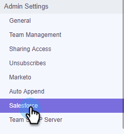

# Sales Connect Customizations for CRM {#sales-connect-customizations-for-crm}

Sales Connect Customizations for CRM - Marketo Docs - Product Documentation

The fields and buttons below are created by the Metadata API in Salesforce CRM. Once the fields are created, admins must configure the page layouts in their CRM to expose them. Instructions can be found [here](http://docs.marketo.com/display/docs/assets/marketo-sales-engage-for-salesforce-installation-and-success-guide.pdf).

>[!NOTE]
>
>This impacts both ToutApp and Sales Connect customers.

### What's in this article? {#what-s-in-this-article}

[How to Install Customizations in Salesforce](#salesconnectcustomizationsforcrm-howtoinstallcustomizationsinsalesforce)  
[Custom Activity Fields](#salesconnectcustomizationsforcrm-customactivityfields)  
[Roll-Up Logging Fields](#salesconnectcustomizationsforcrm-roll-uploggingfields)  
[Buttons](#salesconnectcustomizationsforcrm-buttons)  
[Bulk Action Buttons](#salesconnectcustomizationsforcrm-bulkactionbuttons)  
[User Guides](#salesconnectcustomizationsforcrm-userguides)  
[Related Videos](#salesconnectcustomizationsforcrm-relatedvideos)

#### How to Install Customizations in Salesforce {#salesconnectcustomizationsforcrm-howtoinstallcustomizationsinsalesforce}

1. In Sales Connect, click the gear icon and select **Settings**.

   

1. Under Admin Settings, select **Salesforce**.

   

1. Click **Marketo Sales Connect Customizations**.

   

1. Click **Connect to Salesforce**.

   

1. Log-in to Salesforce.

   

#### Custom Activity Fields {#salesconnectcustomizationsforcrm-customactivityfields}

Marketo will detect the creation of the new fields then do a one-time backfill of data, a re-mapping, and an ongoing sync of values into the **new** fields only. Old fields will not be updated.

| **Field Name** |**Description** |
|---|---|
| MSE Call Local Presence ID |As a user you can choose Local Presence as an option when you make calls from the MSE Phone. Incoming calls will show a local number for the receiver. |
| MSE Call Recording URL |Calls can be recorded and a link for the recording will be logged here. |
| MSE Campaign |Logs name of the MSE campaign the Contact/Lead is a member of. |
| MSE Campaign URL |Logs URL to the campaign that was created in MSE. Clicking on this will open the campaign in the MSE web app. |
| MSE Campaign Current Step |If a contact/lead is part of a campaign, this field will log the name of the step the lead/contact is currently on. |
| MSE Email Attachment Viewed |Logs data when an email is sent with an attachment and the attachment is viewed by the recipient.  |
| MSE Email Clicked |Logs a checkmark when the recipient clicks a link in an email. |
| MSE Email Replied |Logs a checkmark when the recipient replies to an email. |
| MSE Email Status |Shows if an email is sent/in progress/bounced (tracking bounced emails depends on the delivery channel used). |
| MSE Email Template |Logs name of the MSE template that was used in the email sent to the lead/contact. |
| MSE Email Template URL |Logs URL to the template that was created in MSE. Clicking on this will open the template in the MSE web app. |
| MSE Email URL |Clicking on this URL will open Command Center in MSE and pull up the People Detail View history tab where you can see the sent email. |
| MSE Email Viewed |Logs a checkmark when the recipient views an email. |

#### Roll-Up Logging Fields {#salesconnectcustomizationsforcrm-roll-uploggingfields}

<table> 
 <colgroup> 
  <col> 
  <col> 
 </colgroup> 
 <tbody> 
  <tr> 
   <td><strong>Field Name</strong></td> 
   <td><strong>Description</strong></td> 
  </tr> 
  <tr> 
   <td>MSE - Last Marketing Engagement</td> 
   <td>Last incoming engagement from Marketing. </td> 
  </tr> 
  <tr> 
   <td>MSE - Last Marketing Engagement Date</td> 
   <td>Time stamp of engagement from Marketing.</td> 
  </tr> 
  <tr> 
   <td>MSE - Last Marketing Engagement Desc</td> 
   <td>Description of the engagement.</td> 
  </tr> 
  <tr> 
   <td>MSE - Last Marketing Engagement Source</td> 
   <td>Source of Marketing engagement.</td> 
  </tr> 
  <tr> 
   <td colspan="1">MSE - Last Marketing Engagement Type</td> 
   <td colspan="1">Type of Engagement.</td> 
  </tr> 
  <tr> 
   <td colspan="1">MSE - Last Activity by Sales </td> 
   <td colspan="1">Last outgoing activity performed by the Sales team.</td> 
  </tr> 
  <tr> 
   <td colspan="1">MSE - Last Replied</td> 
   <td colspan="1">Last email reply to Sales email.</td> 
  </tr> 
  <tr> 
   <td colspan="1">MSE - Current Sales Campaign</td> 
   <td colspan="1">Logs name of the MSE campaign the lead/contact is a member of.</td> 
  </tr> 
  <tr> 
   <td colspan="1">MSE - Last Sales Engagement</td> 
   <td colspan="1">Last incoming engagement from Sales. </td> 
  </tr> 
  <tr> 
   <td colspan="1">MSE - Opt Out</td> 
   <td colspan="1">Opt-out field.</td> 
  </tr> 
 </tbody> 
</table>

#### Buttons {#salesconnectcustomizationsforcrm-buttons}

| **Button Name** |**Description** |
|---|---|
| Send MSE Email |Send Sales emails from Salesforce. |
| Add to MSE Campaign |Add to MSE campaigns from Salesforce. |
| Push to MSE |Push contact from Salesforce to MSE. |
| Call with MSE |Make Sales calls from Salesforce. |

#### Bulk Action Buttons {#salesconnectcustomizationsforcrm-bulkactionbuttons}

| **Button Name** |**Description** |
|---|---|
| Add to MSE Campaign |Add to MSE campaigns from Salesforce. |
| Push to MSE |Push contact from Salesforce to MSE. |

#### User Guides {#salesconnectcustomizationsforcrm-userguides}

##### [MSE Custom Reports in Salesforce](http://docs.marketo.com/display/docs/assets/mse-custom-reports-in-sf.docx) {#salesconnectcustomizationsforcrm-msecustomreportsinsalesforce}

##### [MSE for Salesforce](http://docs.marketo.com/display/docs/assets/mse-for-sf-classic.pdf) {#salesconnectcustomizationsforcrm-mseforsalesforce}

##### [MSE for Salesforce Lightning](http://s3.amazonaws.com/tout-user-store/salesforce/assets/SF+Guide+for+Lightning.pdf) {#salesconnectcustomizationsforcrm-mseforsalesforcelightning}

#### Related Videos {#salesconnectcustomizationsforcrm-relatedvideos}

**How to install customizations in Salesforce**
`<iframe width="630" height="470" src="//play.vidyard.com/YEPWYBfFEa4nKCo2F6bKKc.html?v=3.1.1" frameborder="0" allowfullscreen></iframe>` ** The benefit of using customizations in Salesforce**
`<iframe width="630" height="470" src="//play.vidyard.com/4PzSDb6o8Qg8WbvBsq8wJD.html?v=3.1.1" frameborder="0" allowfullscreen></iframe>`  