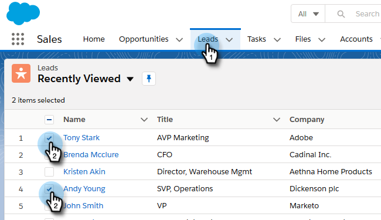
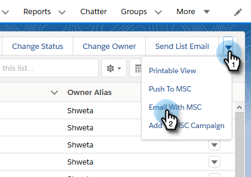
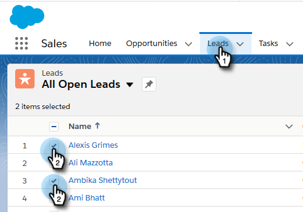
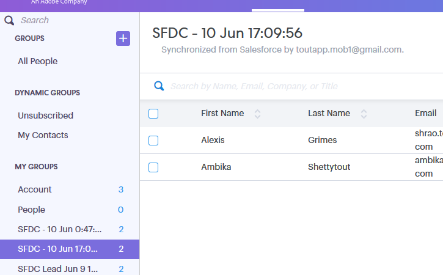

# Using Bulk Actions in Salesforce Lightning {#using-bulk-actions-in-salesforce-lightning}

Using Bulk Actions in Salesforce Lightning - Marketo Docs - Product Documentation

Learn how to perform bulk actions, like adding leads to a campaign, send a bulk email, or pushing leads from Salesforce to Sales Connect.

>[!NOTE]
>
>**Prerequisites**
>
>Update to the latest version of the Sales Connect package and install the bulk action buttons in your lead/contact view. [Click here for instructions](http://s3.amazonaws.com/tout-user-store/salesforce/assets/SF+Guide+for+Lightning.pdf).

>[!NOTE]
>
>Before following the steps below, make sure you're logged in to your Marketo Sales Connect account.

### What's in this article? {#what-s-in-this-article}

[Bulk Email](#usingbulkactionsinsalesforcelightning-bulkemail)  
[Add to Campaign](#usingbulkactionsinsalesforcelightning-addtocampaign)  
[Push to Marketo Sales Connect](#usingbulkactionsinsalesforcelightning-pushtomarketosalesconnect)

#### Bulk Email {#usingbulkactionsinsalesforcelightning-bulkemail}

1. In Salesforce, click the **Leads** tab, then choose the list of desired leads.

   

   >[!NOTE]
   >
   >If you're already on the list you'll be using, you'll have to execute it again by choosing it from the drop-down in order to make sure the MSC bulk action buttons show up. This is Salesforce behavior that cannot be changed.

1. Click the arrow drop-down (on the far right of the screen) and select **Email with MSC**.

   

1. An MSC email will pop up. It includes the following features:

   a. “To” field shows “All receipts” - this corresponds to the list of leads you have chosen in the Lead List View  
   b. This list is visible on the left panel called “Bulk compose” - you can add/remove recipients here  
   c. You can choose a template or create your own email  
   d. You can send the email right away or schedule to send it at a later time

   

#### Add to Campaign {#usingbulkactionsinsalesforcelightning-addtocampaign}

1. In Salesforce, click the **Leads** tab, then choose the list of desired leads.

   

1. Click the arrow drop-down (on the far right of the screen) and select **Add to MSC Campaign**.

   

1. An "Add People to Your Campaign" pop-up will appear. Click **Next** and go through the typical campaign flow to trigger an MSC campaign.

   

#### Push to Marketo Sales Connect {#usingbulkactionsinsalesforcelightning-pushtomarketosalesconnect}

1. In Salesforce, click the **Leads** tab, then choose the list of desired leads.

   

1. Click the arrow drop-down (on the far right of the screen) and select **Push to MSC**.

   

1. A new tab called “Salesforce Bridge” will open. Click the **Proceed to Group →** button.

   

1. You will be sent to your MSC account where you'll see a group created with date/time stamp. You'll receive a notification once the sync is complete and the group will include the leads synced from Salesforce.

   

>[!NOTE]
>
>You can follow the same steps to use bulk actions in Contact List View as well.

>[!NOTE]
>
>**Related Articles**
>
>* [Sending Emails via Group Email](http://docs.marketo.com/x/KAQ6Ag)
>* [Composing Bulk Emails with Select and Send](http://docs.marketo.com/display/public/DOCS/Composing+Bulk+Emails+with+Select+and+Send#ComposingBulkEmailswithSelectandSend-SendingEmails)
>

