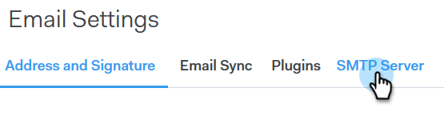
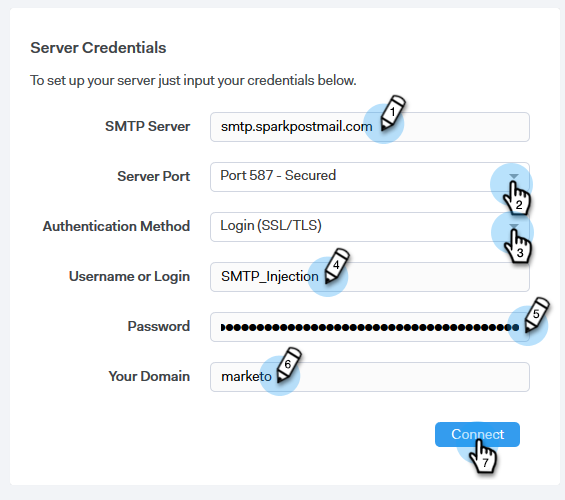
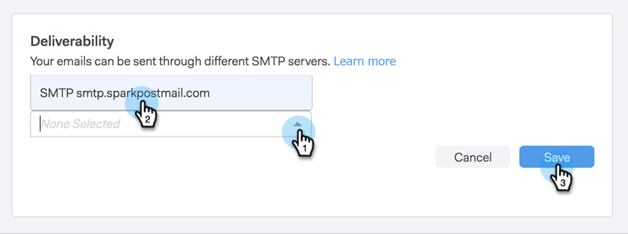

# Setting up Your Delivery Channel {#setting-up-your-delivery-channel}

Setting up Your Delivery Channel - Marketo Docs - Product Documentation

When you start using Marketo Sales Connect, you'll need to set up an SMTP server in order to send out emails.

>[!NOTE]
>
>In addition to setting up your SMTP server, your [email identity has to be verified](http://docs.marketo.com/x/ewPh) before you can send emails.

You can choose to send emails using a Custom SMTP Server, a Team SMTP Server, or Gmail as a delivery channel. Let's go over each option.

### What's in this article? {#what-s-in-this-article}

[Custom SMTP](#settingupyourdeliverychannel-customsmtp)  
[Team SMTP Server](#settingupyourdeliverychannel-teamsmtpserver)  
[Gmail](#settingupyourdeliverychannel-gmail)

#### Custom SMTP {#settingupyourdeliverychannel-customsmtp}

1. Log-in to the [web application](http://toutapp.com/login), click the gear icon on the top right and choose **Settings**.

   

1. Under My Account, click **Email Settings**.

   

1. Select **SMTP Server**.

   

1. Enter your SMTP Server credentials and click **Connect**.

   

   >[!NOTE]
   >
   >If this is your only delivery channel, it's automatically assigned to all of your email identities, and you're done here. If this is not your only delivery channel, please continue to Step 5.

1. While still in Email Settings, click **Address and Signature**.

   

1. Find the email identity for which you want to choose a delivery channel and click **Choose Delivery Channel**.

   

1. In the Deliverability Card, click **Edit**.

   

1. Click the Channel drop-down and choose the custom delivery channel you just added. Click **Save**.

   

   >[!NOTE]
   >
   >If your team admin sets up the Team SMTP Server, it will automatically apply only to your default email identity, and be available as an option for your other email identities.

   **Watch a Video**`<iframe width="630" height="470" src="//play.vidyard.com/YWKSgZvBEjUU8FrXZ5hdYR.html?v=3.1.1" frameborder="0" allowfullscreen></iframe>`

#### Team SMTP Server {#settingupyourdeliverychannel-teamsmtpserver}

>[!NOTE]
>
>**Admin Permissions Required**

1. Log-in to the [web application](http://toutapp.com/login), click the gear icon on the top right and choose **Settings**.

   

1. Under Admin Settings, click **Team SMTP Server**.

   

1. Enter your SMTP Server credentials and click **Connect**.

   

   >[!NOTE]
   >
   >The Team SMTP Server will be the default delivery channel of the default email identity for all team members. Additionally, it will be available as a delivery channel option for all other email identities.

   ** Watch a Video**`<iframe width="630" height="470" src="//play.vidyard.com/Ky9EwGmLcgvsMpFq3H8Y6n.html?v=3.1.1" frameborder="0" allowfullscreen></iframe>`

#### Gmail {#settingupyourdeliverychannel-gmail}

1. Log-in to the [web application](http://toutapp.com/login), click the gear icon on the top right and choose **Settings**.

   

1. Under My Account, click **Email Settings**.

   

1. Click **Email Sync**.

   

1. Click **Connect to Google**.

   

1. Sign in using your Google credentials.
1. When you get to this screen, click **Allow**.

   

   >[!NOTE]
   >
   >If this is your only delivery channel, it's automatically assigned to all of your email identities, and you're done here. If Gmail is not your only delivery channel, please continue to Step 7.

1. Click **Address and Signature**.

   

1. Click the email identity for which you’d like Gmail to be the delivery channel.

   

1. When the slide-panel opens, scroll down to the Deliverability Card.

   

1. Click the Channel drop-down and choose the Gmail delivery channel you just added. Click **Save**.

   

   >[!NOTE]
   >
   >If your team admin sets up the Team SMTP Server, it will automatically apply only to your default email identity, and be available as an option for your other email identities.

