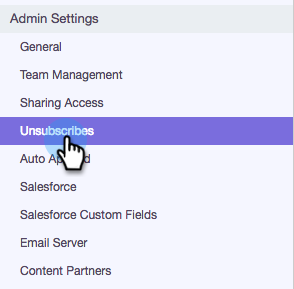
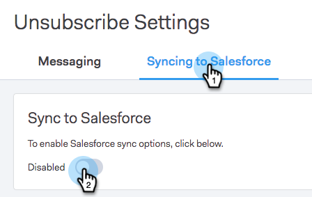
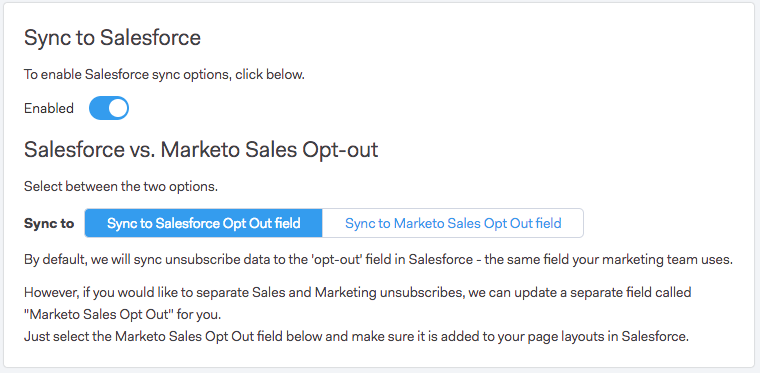
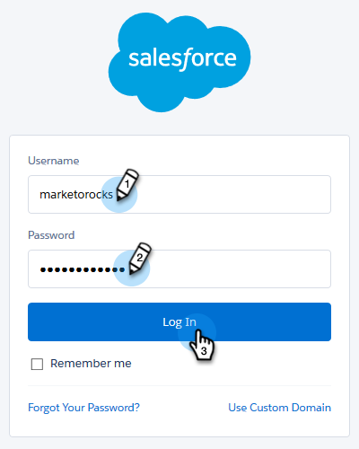

# Syncing Unsubscribes with Salesforce {#syncing-unsubscribes-with-salesforce}

Syncing Unsubscribes with Salesforce - Marketo Docs - Product Documentation

### What's in this article? {#what-s-in-this-article}

[Requirements for Unsubscribes to Sync to Salesforce](#syncingunsubscribeswithsalesforce-requirementsforunsubscribestosynctosalesforce)  
[Configure Unsubscribe Sync to Salesforce](#syncingunsubscribeswithsalesforce-configureunsubscribesynctosalesforce)  
[Installing the Opt Out field in the Page Layout](#syncingunsubscribeswithsalesforce-installingtheoptoutfieldinthepagelayout)  
[Marketo Sales Opt Out](#syncingunsubscribeswithsalesforce-msoomarketosalesoptout)

#### Requirements for Unsubscribes to Sync to Salesforce {#syncingunsubscribeswithsalesforce-requirementsforunsubscribestosynctosalesforce}

* Unsubscribe Sync must be enabled (for nightly sync)
* Opt Out field must be installed in Salesforce
* Person records in must have a Salesforce ID

**Push Unsubscribes**

When an unsubscribe is collected in Sales Connect, we push it to Salesforce in real-time and update either of the Opt Out fields you have selected to sync with. If you've disabled the Salesforce sync, we will still push the unsubscribe over to the email opt out.

**Unsubscribe Sync**

When you've enabled the unsubscribe sync (Step 3 below) you will be turning on the nightly sync. The sync occurs once a day around 8:00 pm PST. It will bidirectionally sync all unsubscribes in MSE/ToutApp with the Opt Out field in Salesforce.

#### Configure Unsubscribe Sync to Salesforce {#syncingunsubscribeswithsalesforce-configureunsubscribesynctosalesforce}

Users can decide whether they want to sync their unsubscribes with the standard Email Opt Out field that Marketo can also sync with, or they can sync with the Marketo Sales Opt Out field so that Sales unsubscribes and Marketing unsubscribes can be differentiated.

1. Go to the [web application](http://toutapp.com/login), click the gear icon and select **Settings**.

   

1. Under Admin Settings select **Unsubscribes**.

   

1. Click **Syncing to Salesforce**, then enable the nightly sync.

   

1. Select the field you'd like to sync to.

   

   | **Sync to Salesforce Opt Out field** |Selected by default, only updates Salesforce Opt Out field. |
   |---|---|
   | **Sync to Marketo Sales Opt Out field** |If you want to separate Sales and Marketing unsubscribes, choose this option to update additional [Marketo Sales Opt Out field.](#SyncingUnsubscribeswithSalesforce-msoo) |

#### Installing the Opt Out field in the Page Layout {#syncingunsubscribeswithsalesforce-installingtheoptoutfieldinthepagelayout}

**Email Opt Out** 
  
Email Opt Out is a standard field in Salesforce that's available to install from Salesforce. You need to be a Salesforce Admin to install it.

1. Go to [Salesforce.com](http://Salesforce.com) and sign in.

   

1. Click your username and select **Setup**.

   

1. In the quick find box search for either Contact or Lead. In this scenario we're installing the field to the Contact page layout, but you'll want to install for both person records.

   

1. Select **Page Layouts**.

   

1. Select **Edit** next to the page layout you would like to add the field to.

   

1. Select **Fields**.

   

1. Drag and drop Email Opt Out into the page layout.

   

1. Click **Save**.

   

#### Marketo Sales Opt Out {#syncingunsubscribeswithsalesforce-msoomarketosalesoptout}

The Marketo Sales Opt Out field is a custom field that is available to users that have installed the Marketo Sales Connect Customizations.

Once you have successfully installed the the Marketo Sales Connect Customizations into Salesforce you will see the Marketo Sales Opt Out field available to you.
