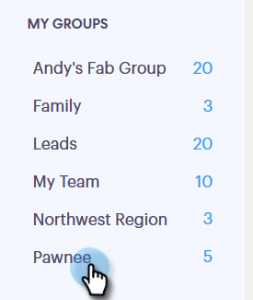
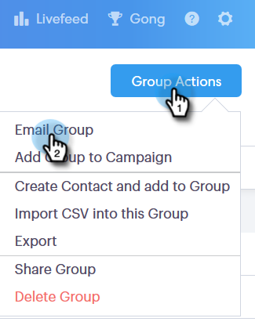

# Sending Emails via Group Email {#sending-emails-via-group-email}

Sending Emails via Group Email - Marketo Docs - Product Documentation

Here's how to send/edit emails using the Group Email option.

### What's in this article? {#what-s-in-this-article}

[Sending a Group Email](#sendingemailsviagroupemail-sendingagroupemail)  
[Editing a Group Email](#sendingemailsviagroupemail-editingagroupemail)

#### Sending a Group Email {#sendingemailsviagroupemail-sendingagroupemail}

1. Click the **People** tab.

   

1. Select the group you'd like to email.

   

1. Click the Group Actions button and select **Email Group**.

   

1. Fill out your email (or select a template) and send (or schedule) it.

   

#### Editing a Group Email {#sendingemailsviagroupemail-editingagroupemail}

1. Create a group email using [Steps 1-3 above](https://docs.marketo.com/display/DOCS/Sending+Emails+via+Group+Email#SendingEmailsviaGroupEmail-SendingaGroupEmail).
1. Choose a template, or fill out your email.

   

1. With the email done, you can now preview each email in the list to see if the dynamic fields are populating correctly.

   

1. Select the desired recipient.

   

1. Click **Preview Dynamic Fields**, and view the preview on the right.

   

   >[!NOTE]
   >
   >You can make bulk edits to the email/template when sending a group email out, but you cannot make unique edits for specific recipients in the list.

>[!NOTE]
>
>**Related Articles**
>
>* [Bulk Sending Options](http://docs.marketo.com/x/HwQ6Ag)
>* [Using a Template in the Compose Window](http://docs.marketo.com/x/MQQ6Ag)
>* [Dynamic Fields](http://docs.marketo.com/x/wwDb)
>

