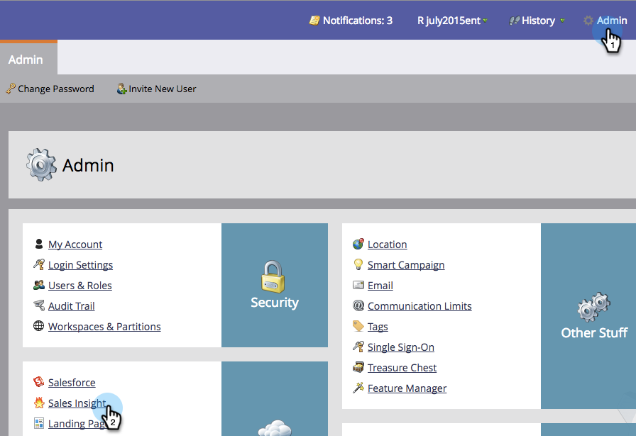

# Lock Sales Template {#lock-sales-template}

Lock Sales Template - Marketo Docs - Product Documentation

To prevent CRM users from editing sales templates, admins can enable the ability to lock templates, which then allows users to lock templates individually from the email editor.

### What's in this article? {#what-s-in-this-article}

[Enable Lock Template](#locksalestemplate-enablelocktemplate)  
[Lock Template in the Email Editor](#locksalestemplate-locktemplateintheemaileditor)

>[!CAUTION]
>
>This feature works for Salesforce only and is not compatible with Microsoft Dynamics or other CRMs. Templates accessed from the Outlook or Gmail plug-ins will not be locked, as the editor is not controlled by Marketo.

#### Enable Lock Template {#locksalestemplate-enablelocktemplate}

>[!NOTE]
>
>**Admin Permissions Required**

1. Go to **Admin**, then click **Sales Insight**.

   

1. Under **Settings**, click **Edit**.

   

1. Check **Enable ability to lock templates**. Click **Save**.

   

>[!NOTE]
>
>By default, this box is checked and the ability to lock templates is enabled. Unchecking it will disable the lock template feature in the email editor.

>[!NOTE]
>
>Changing this setting as an admin will **not** retroactively affect existing templates; i.e., it will not lock them automatically.

#### Lock Template in the Email Editor {#locksalestemplate-locktemplateintheemaileditor}

1. Select the email you wish to lock, then click **Edit Draft**.

   

1. In the email editor, click **Email Settings**.

   

   3. Check **Publish to Marketo Sales Insight** if it's not already checked. You can now uncheck **Allow CRM user to edit email** in order to lock the template. Click **Save**.

   

   >[!NOTE]
   >
   >By default, this box is checked and CRM users are allowed to edit emails.

