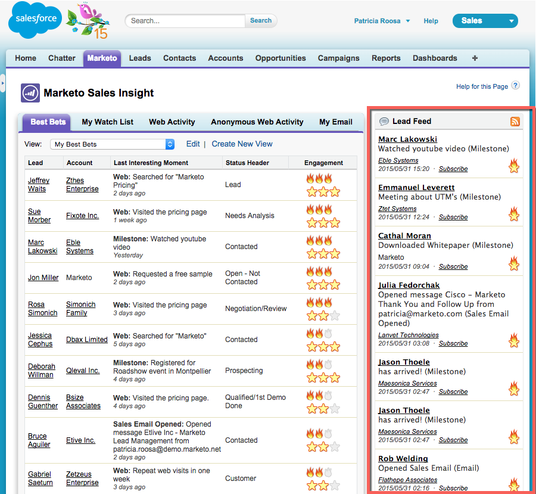
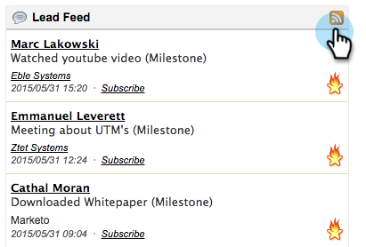

# Using the Lead Feed {#using-the-lead-feed}

Using the Lead Feed - Marketo Docs - Product Documentation

The Lead Feed is an up-to-the-minute list of interesting events done by your leads. You'll find it on the right-hand side when you click the Marketo tab. It's like an RSS or Twitter feed - the most recent updates are at the top of the list. Use this to jump on leads while you're still fresh in their minds.

### What's in this article? {#what-s-in-this-article}

[What's in the Lead Feed?](#usingtheleadfeed-what'sintheleadfeed)  
[Getting RSS Updates](#usingtheleadfeed-gettingrssupdates)

>[!NOTE]
>
>The lead feed includes both the leads you own and the leads in your watch list.

#### What's in the Lead Feed? {#usingtheleadfeed-what'sintheleadfeed}

Each item in the lead feed is an interesting moment - a noteworthy activity or event in this lead's marketing history.

When viewing it in Salesforce, each item has:

<table> 
 <tbody> 
  <tr> 
   <td>
Item
</td> 
   <td>
Description
</td> 
  </tr> 
  <tr> 
   <td>
A. Lead/Contact
</td> 
   <td>
Person who had this interesting moment
</td> 
  </tr> 
  <tr> 
   <td>
B. Event Type
</td> 
   <td>
Category for this moment -- web, email, or milestone
</td> 
  </tr> 
  <tr> 
   <td>
C. Account Name
</td> 
   <td>
Company name
</td> 
  </tr> 
  <tr> 
   <td>
D. Time
</td> 
   <td>
When this interesting moment occurred
</td> 
  </tr> 
  <tr> 
   <td>
E. Event Description
</td> 
   <td>
Reason for this interesting moment
</td> 
  </tr> 
  <tr> 
   <td>
F. Subscribe
</td> 
   <td>
Receive email notification for events like this
</td> 
  </tr> 
  <tr> 
   <td>
G. Star
</td> 
   <td>
This person is a Best Bet (high priority)
</td> 
  </tr> 
 </tbody> 
</table>

#### Getting RSS Updates {#usingtheleadfeed-gettingrssupdates}

You can also get Lead Feed updates by RSS feed. An RSS feed lets you receive updates on your leads even if you're not connected to Salesforce. The feed has the same information as the Lead Feed in Salesforce as well as the following (when available):

* `email address`
* `phone number`
* `mobile number`
* `fax number`
* `company address`
* `company URL`

>[!NOTE]
>
>Your company's Marketo administrator must [enable RSS feeds](../../../../../../welcome-to-marketo-docs/product-docs/marketo-sales-insight/msi-for-salesforce/features/msi-configuration-tab/enable-rss-for-sales-insight.md) for this to work.

To get RSS updates, you'll need two things: the RSS link and an RSS feed reader. You can get the RSS link by clicking the RSS icon in the lead feed:   

The RSS feed will appear in a new window. You can then copy the URL for your RSS feed and use it in an RSS reader. Most browsers have a built-in RSS reader, or you can use an RSS reader specific to your platform.
