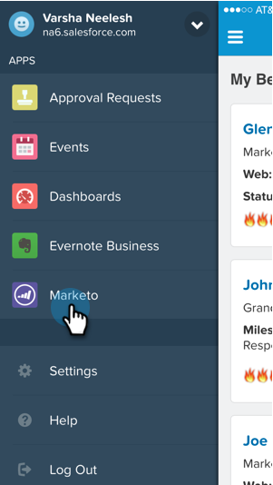

# Seeing Lead Feed in Salesforce1 {#seeing-lead-feed-in-salesforce}

Seeing Lead Feed in Salesforce1 - Marketo Docs - Product Documentation

The Lead Feed is an up-to-the-minute list of interesting events done by your leads.

1. Go to the **Marketo** area in Salesforce1.

   

1. Tap the down arrow.

   

1. Tap **Lead Feed**.

   

   Perfect! Now you know how to get to your Lead Feed!

   

>[!NOTE]
>
>**Related Articles**
>
>* [Interesting Moments in Salesforce1](interesting-moments-in-salesforce1.md)
>* [Send Marketo Email and Campaign and Watchlist Actions in Salesforce1](send-marketo-email-and-campaign-and-watchlist-actions-in-salesforce1.md)
>* [Best Bets in Salesforce1](best-bets-in-salesforce1.md)
>

