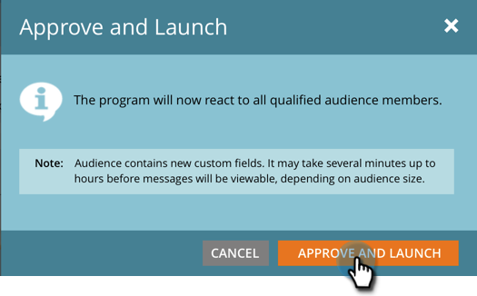

# Approve Your In-App Message {#approve-your-in-app-message}

Approve Your In-App Message - Marketo Docs - Product Documentation

You need to approve the send before the in-app message goes out.

1. If everything looks OK, click **Approve and Launch**.

   

   >[!NOTE]
   >
   >If any part of the send process is incomplete, for example, the in-app message isn't approved, a warning message appears, indicating which area needs your attention. Go fix that and you should see the message in step 2.

1. Click **Approve and Launch**.

   

1. If you used custom fields, Marketo may take longer to run, and will display this message instead.

   

1. The message is now active.

   

   >[!NOTE]
   >
   >It normally takes 15 to 30 minutes for an approved in-app message to be visible to visitors in your program. Remember, if you used custom fields, it could take several hours or longer.

   You can pause or stop an active program, but there's a big difference between those two options.

1. Click **Pause Program** if you need to stop the program for a while but resume it later. It'll change to **Paused** status.

   

   >[!NOTE]
   >
   >Reasons for pausing could be just to stop it for a while, or if you want to modify the message or adjust the schedule. However, you can't change to a different message, only edit the existing one.

1. When you want the paused program to continue running, click **Resume** **Program**.

   

1. To stop the program entirely, click **Stop Program**.

   

1. If you're sure you want to stop the program, click **Stop**.

   ** 

   **

   >[!NOTE]
   >
   >When you stop a program, it no longer runs and can't be resumed. If you want to run it again, you'll have to rebuild it. So, make sure you're done with a program before you click **Stop Program**!

   #### In-App Dashboard {#approveyourin-appmessage-in-appdashboard}

   After your program runs, you can monitor its performance with the In-App Dashboard, which appears automatically after you approve the program. To return to the program, click the link in the upper right and select **Control Panel**.

   That's all, folks!

