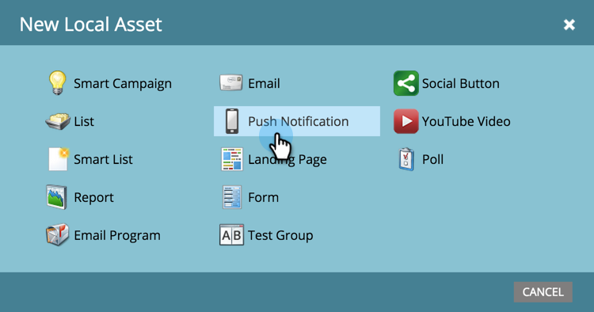

# Create a Push Notification {#create-a-push-notification}

Create a Push Notification - Marketo Docs - Product Documentation

It's easy to create a push notification. However, before you begin, you must have your Marketo Admin and Mobile Apps Developer set up some things you'll need while you're doing it. See [Understanding Push Notifications](understanding-push-notifications.md) for details.

1. Go to the **Marketing Activities** area.

   

1. Find and select your program.

   

1. Under **New**, click **New Local Asset**.

   

1. Select **Push Notification**.

   

1. Enter a **Push Notification Name** and click **Create**.

   

   Sweet! Now that the Push Notification is created, let's go ahead and [dress it up](configure-mobile-push-notification.md).

