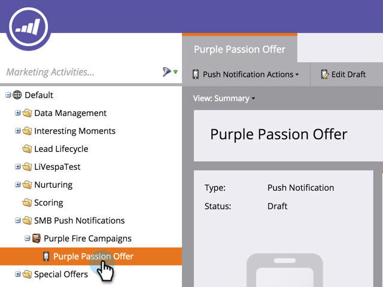

# Delete Mobile Push Notification {#delete-mobile-push-notification}

Delete Mobile Push Notification - Marketo Docs - Product Documentation

##### 1. Go to the Marketing Activities area. {#deletemobilepushnotification-gotothemarketingactivitiesarea}

1. Find and Select your Mobile Push Notification.

   

1. Under **Push Notification Actions**, click **Delete**.

   

   ##### Confirm by clicking DELETE. {#deletemobilepushnotification-confirmbyclickingdelete}

   

   >[!NOTE]
   >
   >If the Mobile Push Notification is being used by other assets you won't be allowed to delete it. You have to go and remove it from the assets.

