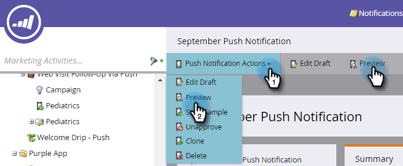
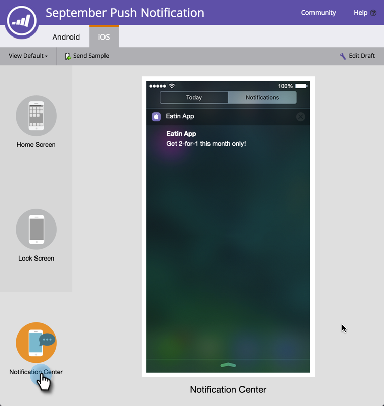

# Preview a Push Notification {#preview-a-push-notification}

Preview a Push Notification - Marketo Docs - Product Documentation

It's easy to preview what your push notification will look like, for either Android or iOS. There are four ways to do it.

In the navigation tree, right-click the file for the notification you want to preview and click **Preview**.

>[!NOTE]
>
>If push notification is enabled for only one platform, the tab for the other platform isn't displayed.

Or, on the Push Notification view page, click **Push Notifications Actions** and then **Preview**. Or, click **Preview **on the far right.** **

Finally, in the editor, you can click the **Preview Draft** tab in the upper right while you're working on the notification.

#### Android Previews {#previewapushnotification-androidpreviews}

Click the icon on the left to see exactly where the push notification will display when you send it. Click or use keyboard arrows to toggle between them.

On the Home screen, the notification appears a little below the top, under the icons.

On the Lock screen, it pops up partway down, under the time.

>[!NOTE]
>
>There isn't a Notification Center view in Android.

#### iOS Previews {#previewapushnotification-iospreviews}

As with Android, click or use keyboard arrows to toggle between views.

On the Home screen, the notification appears at the top.

On the Lock screen, it shows partway down.

On the Notification Center screen, it's up near the top,

So, with push notification preview, you always know what your customers are going to see!

>[!NOTE]
>
>**Related Articles**
>
>* [Create a Push Notification](create-a-push-notification.md)
>* [Configure Mobile Push Notification](configure-mobile-push-notification.md)
>

