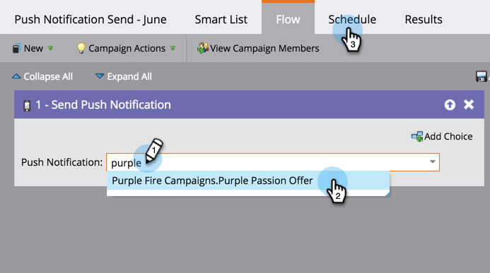

# Send a Mobile Push Notification {#send-a-mobile-push-notification}

Send a Mobile Push Notification - Marketo Docs - Product Documentation

Send a push notification to people using your mobile app. 

>[!NOTE]
>
>**Prerequisites**
>
>* [Create a New Smart Campaign](../../../../welcome-to-marketo-docs/product-docs/core-marketo-concepts/smart-campaigns/creating-a-smart-campaign/create-a-new-smart-campaign.md)
>* [Create a Push Notification](create-a-push-notification.md)
>

1 . Go to the **Marketing Activities** area.      2. Select your smart campaign and click **Smart List**.      3. Define your smart list then click **FLOW.**    5. Select a push notification. Click **Schedule** 

>[!NOTE]
>
>The push notification must be approved before it appears on the drop-down.

6. Click **Run Once**    7. Choose a date and time. Click **SAVE.** 

Sit back and wait for your push notification to go out. 