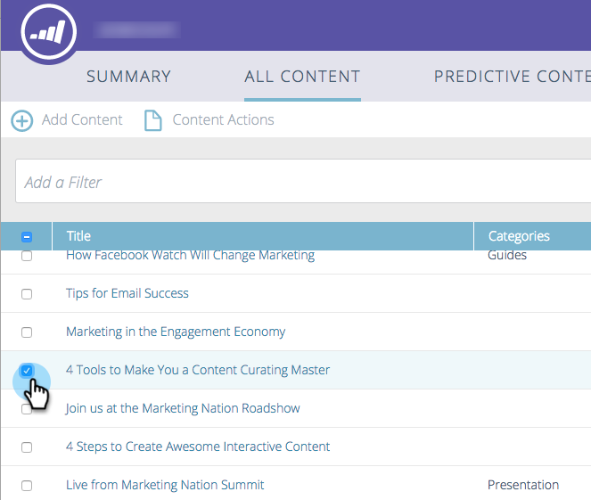

# Delete Content {#delete-content}

Delete Content - Marketo Docs - Product Documentation

>[!NOTE]
>
>Depending on the purchase date, your Marketo subscription may include either Marketo Predictive Content or Content`AI`. For those using Predictive Content, Marketo is enabling Content`AI` Analytics features until April 30, 2018. To keep these features beyond that date, please contact your Marketo Customer Success Manager to upgrade to Marketo Content`AI`.

When you don't need a piece of content anymore, it's easy to get rid of it.

1. Check the box next to the piece of content you want to remove.

   

1. Click the **Content Actions** drop-down and select **Delete Content**.

   

   That's it.

