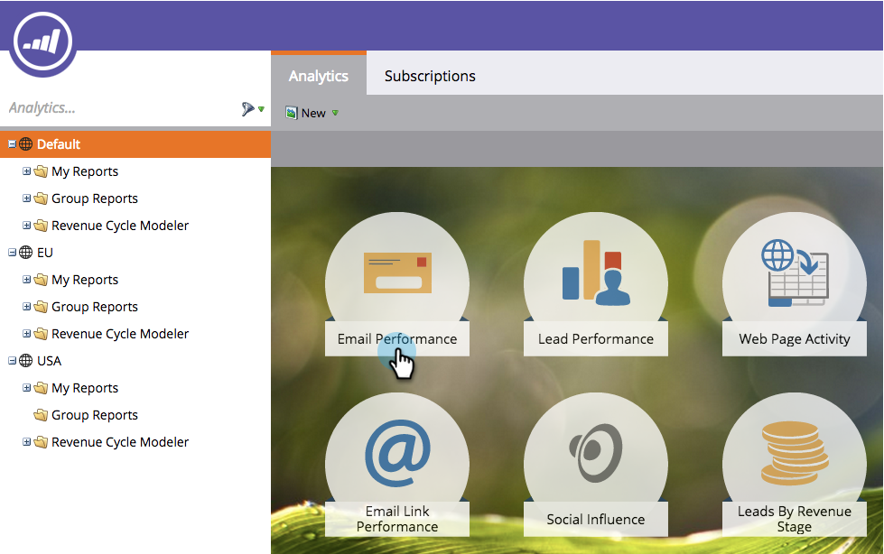
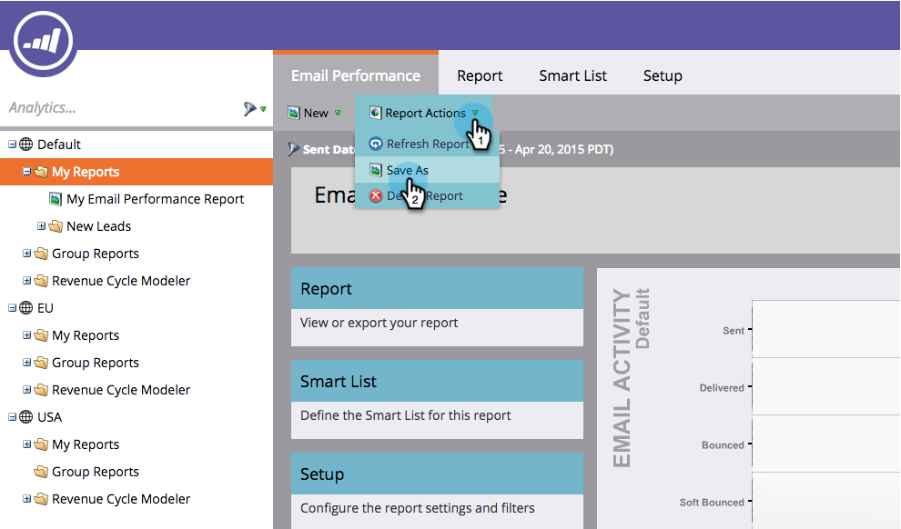
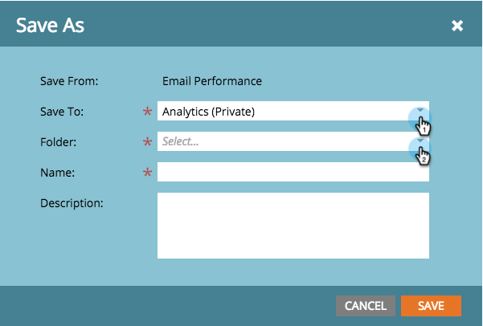

# Save a Report {#save-a-report}

Save a Report - Marketo Docs - Product Documentation

Sometimes, you may need to save a default report to view again later. Here's how you can do that:

1. Go to the **Analytics** area.
1. 

1. Select a [report type](../../../../../welcome-to-marketo-docs/product-docs/reporting/basic-reporting/report-types/report-type-overview.md).

   

1. Click **Report Actions **and select **Save As**.

   

1. **Save To** a location and select a **Folder**.

   

1. **Name** the report and click **Save**.

   

   Cool! Your saved report will now appear in the tree.

   

>[!NOTE]
>
>**Related Articles**
>
>Learn how to [clone a report to group reports](../../../../../welcome-to-marketo-docs/product-docs/reporting/basic-reporting/report-activity/clone-a-report-to-group-reports.md).

