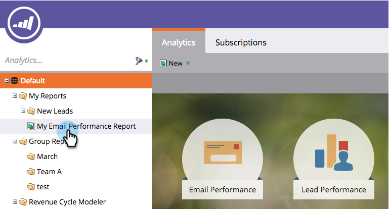
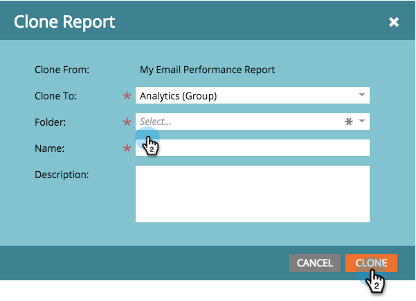

# Clone a Report to Group Reports {#clone-a-report-to-group-reports}

Clone a Report to Group Reports - Marketo Docs - Product Documentation

Any report in **My Reports **is only visible to you. What if you wanted to make the report accessible all others? Here's how you can do that:

1. In the **Analytics **area, click on the desired [saved report](../../../../../welcome-to-marketo-docs/product-docs/reporting/basic-reporting/creating-reports/save-a-report.md).
1. 

   >[!NOTE]
   >
   >Alternatively, a saved report can be cloned to **Group Reports **by dragging the report into the folder.

1. Click **Report Actions **and select **Clone Report**.

   

1. **Clone To** a **Analytics (Group)** and select a **Folder**.

   

1. **Name** the report and click **Clone**.

   

   Cool! Your report will now appear in **Group Reports.**

   

