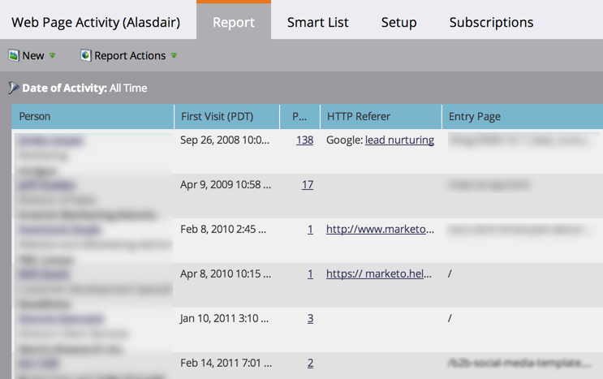

# Web Page Activity Report {#web-page-activity-report}

Web Page Activity Report - Marketo Docs - Product Documentation

In this report, you can see who's visiting your website and even subscribe to an email version of the report.

You can choose to display known people or anonymous people, but not both kinds on the same report.

>[!NOTE]
>
>**Prerequisites**
>
>* [Add Munchkin Tracking Code to Your Website](../../../../../welcome-to-marketo-docs/product-docs/administration/additional-integrations/add-munchkin-tracking-code-to-your-website.md)
>

1. [Create a report](../../../../../welcome-to-marketo-docs/product-docs/reporting/basic-reporting/creating-reports/create-a-report-in-a-program.md)and select the** Web Page Activity Report** [report type](report-type-overview.md).
1. Choose to [display known or anonymous people](../../../../../welcome-to-marketo-docs/product-docs/reporting/basic-reporting/report-activity/display-people-or-anonymous-visitors-in-web-reports.md) in the report.
1. [Set the time frame of your report](../../../../../welcome-to-marketo-docs/product-docs/reporting/basic-reporting/editing-reports/change-a-report-time-frame.md) and click the **Report** tab.
1. You've got it! Review your report to see who is visiting your site.

   

   >[!NOTE]
   >
   >It can take up to 24 hours for data to reflect in a Web Page Activity Report.

   >[!TIP]
   >
   >To find out who visits your site the most, [sort your report](../../../../../welcome-to-marketo-docs/product-docs/reporting/basic-reporting/editing-reports/sort-report-on-columns.md) on the *Page Views* column and choose Sort Descending.

   [Marketo adds anonymous](../../../../../welcome-to-marketo-docs/product-docs/reporting/basic-reporting/report-activity/tracking-anonymous-activity-and-people.md) website visitors to your database and you can choose to show them in this report. It provides a wealth of information even though they are anonymous.  
   [Columns that you can select](../../../../../welcome-to-marketo-docs/product-docs/reporting/basic-reporting/editing-reports/select-report-columns.md) for a Web Page Activity report include:

<table> 
 <thead> 
  <tr> 
   <th>Column(s)</th> 
   <th>Description</th> 
  </tr> 
 </thead> 
 <tbody> 
  <tr> 
   <td>Person</td> 
   <td>The visitor's name, title, and company. <strong>Click</strong> to view person details and activity history.</td> 
  </tr> 
  <tr> 
   <td>First/Last Visit (Time zone)</td> 
   <td>Date and time of the first/last visit by anyone from this company.</td> 
  </tr> 
  <tr> 
   <td>Page Views</td> 
   <td>Number of pages loaded by this visitor. <strong><a href="web-page-activity-report/web-pages-viewed-web-page-activity-report.md">Click</a></strong> to view which pages were visited.</td> 
  </tr> 
  <tr> 
   <td>HTTP Referer</td> 
   <td>URL of the page that contains the link the visitor followed to your page.</td> 
  </tr> 
  <tr> 
   <td>Entry Page</td> 
   <td>First page the person visited </td> 
  </tr> 
  <tr> 
   <td>Inferred Company or ISP</td> 
   <td>The company, as inferred from the visitors' IP address. <strong>Names in bold</strong> indicate this is the company, not the ISP. </td> 
  </tr> 
  <tr> 
   <td>Inferred Country, State/Region, &amp; City</td> 
   <td>Geographic location of the visitor, as inferred from their IP address.</td> 
  </tr> 
 </tbody> 
</table>

   >[!TIP]
   >
   >Thrill your sales reps! [Filter the report](../../../../../welcome-to-marketo-docs/product-docs/reporting/basic-reporting/editing-reports/filter-people-in-a-report-with-a-smart-list.md)for their territory and [subscribe them to it](../../../../../welcome-to-marketo-docs/product-docs/reporting/basic-reporting/report-subscriptions/subscribe-to-a-basic-report.md)!

   >[!NOTE]
   >
   >**Related Articles**
   >
   >    
   >    
   >    * [Web Pages Viewed, Web Page Activity Report](web-page-activity-report/web-pages-viewed-web-page-activity-report.md)
   >    * [Display People or Anonymous Visitors in Web Reports](../../../../../welcome-to-marketo-docs/product-docs/reporting/basic-reporting/report-activity/display-people-or-anonymous-visitors-in-web-reports.md)
   >    
   >

   >[!NOTE]
   >
   >**Deep Dive**
   >
   >
   >Learn about other interesting reports in [Basic Reporting](../../../../../welcome-to-marketo-docs/product-docs/reporting/basic-reporting.md).

