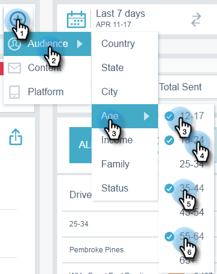

# Filtering in Email Insights {#filtering-in-email-insights}

Filtering in Email Insights - Marketo Docs - Product Documentation

In Email Insights, there are different ways to filter your data.

### What's in this article? {#what-s-in-this-article}

[Email Insights](#filteringinemailinsights-emailinsights)  
[Account Based Marketing](#filteringinemailinsights-accountbasedmarketing)

#### Email Insights {#filteringinemailinsights-emailinsights}

##### Click the + to start adding filters. Add as many as you'd like. {#filteringinemailinsights-clickthe+tostartaddingfilters-addasmanyasyou'dlike}

##### If you have more than one filter in the same category, they will merge and display the amount. {#filteringinemailinsights-ifyouhavemorethanonefilterinthesamecategory-theywillmergeanddisplaytheamount}

##### If you ever need to see which filters you've applied, simply click the filter. You can even add more there. {#filteringinemailinsights-ifyoueverneedtoseewhichfiltersyou'veapplied-simplyclickthefilter-youcanevenaddmorethere}

##### You can also add additional types of filters. {#filteringinemailinsights-youcanalsoaddadditionaltypesoffilters}

##### And even more filters! {#filteringinemailinsights-andevenmorefilters}

##### The chart changes after each filter is applied. {#filteringinemailinsights-thechartchangesaftereachfilterisapplied}

##### To delete a category, click its X. {#filteringinemailinsights-todeleteacategory-clickitsx}

##### To clear all filters, click the X at the end of the filter bar. {#filteringinemailinsights-toclearallfilters-clickthexattheendofthefilterbar}

##### For date-specific data, use date ranges. {#filteringinemailinsights-fordate-specificdata-usedateranges}

##### Choose from common preset date ranges, select specific dates, even use the previous period for comparison. {#filteringinemailinsights-choosefromcommonpresetdateranges-selectspecificdates-evenusethepreviousperiodforcomparison}

>[!NOTE]
>
>Date ranges apply to both the Analytics page and Sends page. The **Compare** option is only applicable to the Analytics page, however.

#### Account Based Marketing {#filteringinemailinsights-accountbasedmarketing}

##### If you use [Account Based Marketing](http://docs.marketo.com/display/DOCS/Account+Based+Marketing+Overview), there are filters specifically for you. {#filteringinemailinsights-ifyouuseaccountbasedmarketing-therearefiltersspecificallyforyou}

