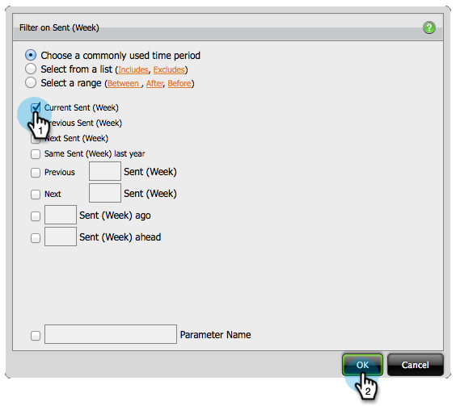
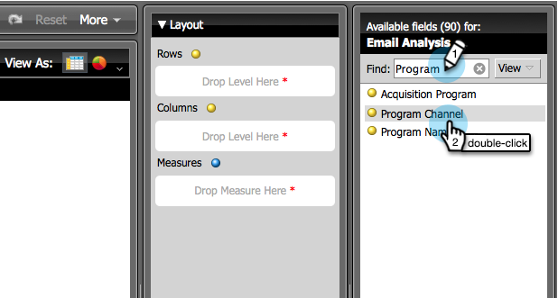

# Build an Email Analysis Report that Shows Program Information {#build-an-email-analysis-report-that-shows-program-information}

Build an Email Analysis Report that Shows Program Information - Marketo Docs - Product Documentation

Follow these steps to create an Email Analysis Report that will show email information grouped by program channels.

>[!NOTE]
>
>**Availability**
>
>Not all customers have purchased this functionality. Contact your sales rep for details.

1. Launch **Revenue Explorer**.

   

1. Click on **New Report**.

   

1. Select** Email Analysis** area and click **OK**.

   

1. Find the **Sent (Week)** yellow dot and right click it. Click **Filter**.

   >[!NOTE]
   >
   >This will narrow down the timeframe of the report.

   

1. Check **Current Sent Week** and click **OK**.

   

1. Find and double click the** Program Channel** yellow dot.

   

1. Find and double click the **Email Name** yellow dot.

   

1. Find and double click the **Sent**, **Opened** and **Clicked** blue dots.

   

   Great job! You should have a report that looks something like this:

   

   >[!NOTE]
   >
   >**Deep Dive**
   >
   >
   >Want to learn more about [Revenue Cycle Explorer](../../../../../welcome-to-marketo-docs/product-docs/reporting/revenue-cycle-analytics.md)?

