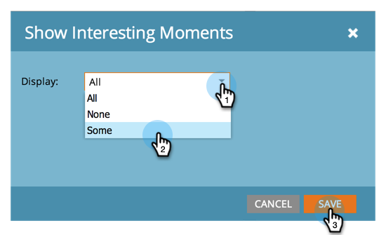

# Configure an Opportunity Influence Analyzer {#configure-an-opportunity-influence-analyzer}

Configure an Opportunity Influence Analyzer - Marketo Docs - Product Documentation

Once you [create an Opportunity Influence Analyzer](create-an-opportunity-influence-analyzer.md), you can configure the types of [interesting moments](../../../../../welcome-to-marketo-docs/product-docs/marketo-sales-insight/msi-for-salesforce/features/tabs-in-the-msi-panel/interesting-moments-(msi)/interesting-moments-overview.md) that are included.

>[!NOTE]
>
>**Prerequisites**
>
>* [Create an Opportunity Influence Analyzer](create-an-opportunity-influence-analyzer.md)
>

##### 1. Click on Analytics. {#configureanopportunityinfluenceanalyzer-clickonanalytics}

##### 2. Go to Analytics and select your Opportunity Influence Analyzer. {#configureanopportunityinfluenceanalyzer-gotoanalyticsandselectyouropportunityinfluenceanalyzer}

If there are too many interesting moments in the analyzer graph, you can reduce them by deselecting people in the **Settings** panel, or by reducing the types of interesting moments.

##### 3. To configure which types of interesting moments to include, go to the Setup tab and drag in the Interesting Moments filter. {#configureanopportunityinfluenceanalyzer-toconfigurewhichtypesofinterestingmomentstoinclude-gotothesetuptabanddragintheinterestingmomentsfilter}

 

##### 4. Choose whether to show All, None, or Some. {#configureanopportunityinfluenceanalyzer-choosewhethertoshowall-none-orsome}

 

##### 5. If you choose Some, you can then choose which types to include. {#configureanopportunityinfluenceanalyzer-ifyouchoosesome-youcanthenchoosewhichtypestoinclude}

 

##### 6. Click each type of interesting moment you want. Then click Save. {#configureanopportunityinfluenceanalyzer-clickeachtypeofinterestingmomentyouwant-thenclicksave}

##### 7. Click the main tab to see the history of the opportunity with just the selected types of interesting moment. {#configureanopportunityinfluenceanalyzer-clickthemaintabtoseethehistoryoftheopportunitywithjusttheselectedtypesofinterestingmoment}

>[!NOTE]
>
>**Related Articles**
>
>* [Tell the Marketing Story with an Opportunity Influence Analyzer](tell-the-marketing-story-with-an-opportunity-influence-analyzer.md)
>

>[!NOTE]
>
>**Deep Dive**
>
>For other analyzers, see [Basic Reporting](../../../../../welcome-to-marketo-docs/product-docs/reporting/basic-reporting.md).

