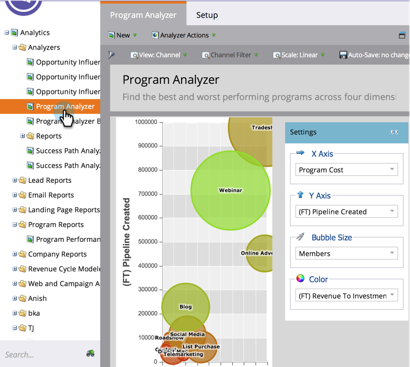
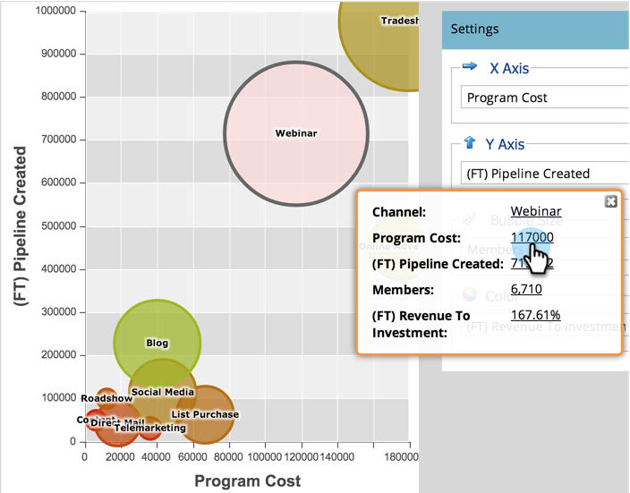

# Explore Program & Channel Details with the Program Analyzer {#explore-program-channel-details-with-the-program-analyzer}

Explore Program & Channel Details with the Program Analyzer - Marketo Docs - Product Documentation

You can see detailed program and channel stats in the Program Analyzer. You can also open them in Revenue Cycle Explorer.

>[!NOTE]
>
>**Prerequisites**
>
>* [Create a Program Analyzer](create-a-program-analyzer.md)
>

>[!NOTE]
>
>**Availability**
>
>Not all Marketo editions include this functionality. Contact your account manager for more detail.

1. Click on **Analytics**.

   

1. Select your Program Analyzer.

   

1. To see the specific statistics for a channel or program (depending on the **View** you select), click the corresponding bubble.

   

   >[!NOTE]
   >
   >Many of the metrics you can choose in the program analyzer are available with first-touch (FT) and multi-touch (MT) calculations. It is important to understand the [difference between FT and MT attribution](../../../../../welcome-to-marketo-docs/product-docs/reporting/revenue-cycle-analytics/revenue-tools/understanding-attribution.md).

1. To compare all the programs within a single channel, click the channel name in the pop-up dialog.

   

1. Now you can compare the individual programs within that one channel!

   

   >[!NOTE]
   >
   >Clicking a single channel switches your view to By Program, filtered to just that channel. To return to all channels, select **View** > **By Channel**.

1. To open the Revenue Cycle Explorer to dig even deeper into a statistic, click that number in the pop-up dialog.

   

   >[!NOTE]
   >
   >**Deep Dive**
   >
   >
   >Learn more about advanced analytics in [Revenue Explorer](../../../../../welcome-to-marketo-docs/product-docs/reporting/revenue-cycle-analytics/revenue-explorer.md).

