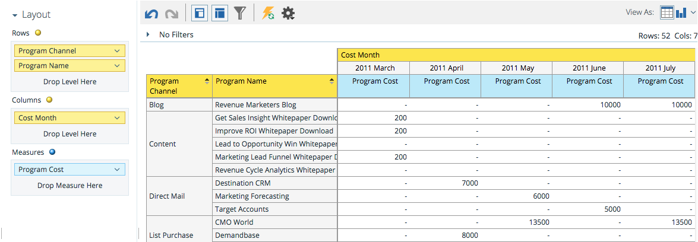

# Understanding the Program Cost Analysis Area {#understanding-the-program-cost-analysis-area}

Understanding the Program Cost Analysis Area - Marketo Docs - Product Documentation

The Program Cost Analysis area allows you to analyze the effectiveness of individual programs, or to see summarized results by channel for a given period of time.

## Example Business Questions {#understandingtheprogramcostanalysisarea-examplebusinessquestions}

How many new names did each channel generate per month?

What was my cost per new name by channel per month?

What percentage of the new names generated reached success in a program?

How much did I spend per program per month?

## Program Cost Analysis Dimensions and Measures {#understandingtheprogramcostanalysisarea-programcostanalysisdimensionsandmeasures}

>[!NOTE]
>
>Yellow dots are dimensions and blue dots are measures.

#### Investment {#understandingtheprogramcostanalysisarea-investment}

| Measure |Description |
|---|---|
| Cost per Member |Average cost per member of the program |
| Cost per New Name |Average cost per lead acquired by the program |
| Cost per Success |Average cost per lead who achieved success in the progression of a program |
| Cost per Success (New Names) |Average cost per lead acquired by the program AND achieved success in the progression of the program |
| Program Cost |Total period cost of the program |

#### Membership {#understandingtheprogramcostanalysisarea-membership}

<table> 
 <tbody> 
  <tr> 
   <th>Measure</th> 
   <th>Description</th> 
  </tr> 
  <tr> 
   <td>
% New Names
</td> 
   <td>Percentage of leads who were acquired by a program</td> 
  </tr> 
  <tr> 
   <td>Members</td> 
   <td>Total leads in a program</td> 
  </tr> 
  <tr> 
   <td>New Names</td> 
   <td>Total new names acquired by a program</td> 
  </tr> 
 </tbody> 
</table>

#### Program Attributes {#understandingtheprogramcostanalysisarea-programattributes}

| Dimension |Description |
|---|---|
| Program Channel |Program Channel |
| Program Name |Program Name |

#### Program Cost Timeframe {#understandingtheprogramcostanalysisarea-programcosttimeframe}

| Dimension |Description |
|---|---|
| Year |Program Cost timeframe |
| Quarter |Program Cost time frame |
| Month |Program Cost timeframe |

#### Program Tags {#understandingtheprogramcostanalysisarea-programtags}

| Measure |Description |
|---|---|
| Industry |Program Tag |
| Product Line |Program Tag |
| Program Owner |Program Tag |
| Region |Program Tag |

#### Success {#understandingtheprogramcostanalysisarea-success}

| Measure |Description |
|---|---|
| % Success (New Names) |Percentage of leads who were acquired by the program AND achieved success in the progression of the program |
| % Success (Total) |Percentage of leads who achieved success in the progression of a program |
| Success (New Names) |Total number of new names who achieved success in the progression of a program |
| Success (Total) |Total number of leads who achieved success in the progression of a program |

