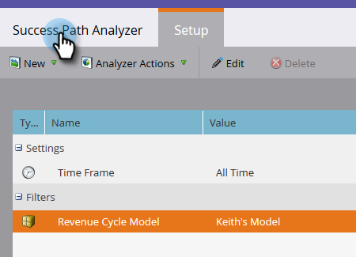

# Create a Success Path Analyzer {#create-a-success-path-analyzer}

Create a Success Path Analyzer - Marketo Docs - Product Documentation

Get a visual representation of velocity and flow through your [Revenue Cycle Model](../../../../../welcome-to-marketo-docs/product-docs/reporting/revenue-cycle-analytics.md).

>[!NOTE]
>
>**Prerequisites**
>
>[Create a New Revenue Model](create-a-new-revenue-model.md)

##### 1. Click the Analytics tile. {#createasuccesspathanalyzer-clicktheanalyticstile}

  

##### 2. Click the Success Path Analyzer icon. {#createasuccesspathanalyzer-clickthesuccesspathanalyzericon}

>[!NOTE]
>
>If you receive a warning that no data was found in the specified time frame, just click **Close** to change your time frame. If you aren't prompted, but you want to change your time frame, go to **Setup** and double-click** ****Time Frame**.

##### 3. If you had no data, or you're changing your time frame, select one from the drop-down and click Save. {#createasuccesspathanalyzer-ifyouhadnodata-oryou'rechangingyourtimeframe-selectonefromthedrop-downandclicksave}

>[!TIP]
>
>To select a specific range, select **Custom** and use the **From** and **To** fields.

##### 4. If you have more than one Revenue Cycle Model, select the one you want from the Setup tab. {#createasuccesspathanalyzer-ifyouhavemorethanonerevenuecyclemodel-selecttheoneyouwantfromthesetuptab}

  

##### 5. Pick the appropriate model and click Apply. {#createasuccesspathanalyzer-picktheappropriatemodelandclickapply}

  

##### 6. Click the Success Path Analyzer tab. {#createasuccesspathanalyzer-clickthesuccesspathanalyzertab}

Now you can explore movement from each stage to the next!

>[!TIP]
>
>Wanna save your report? Click the **Analyzer Actions** drop-down and select **Save As**.

>[!NOTE]
>
>**Related Articles**
>
>* [Using the Success Path Analyzer](using-the-success-path-analyzer.md)
>

