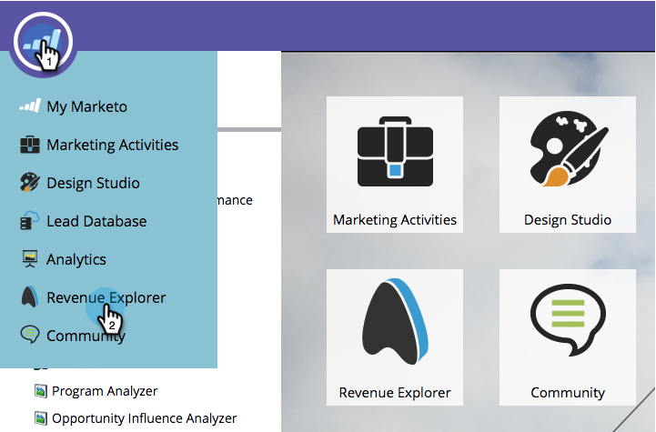
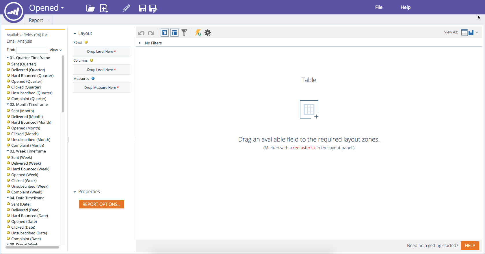

# Create a Revenue Explorer Report {#create-a-revenue-explorer-report}

Create a Revenue Explorer Report - Marketo Docs - Product Documentation

The Revenue Explorer report allows you to track the ROI on your marketing initiatives.

>[!NOTE]
>
>**Availability**
>
>Not all customers have purchased this functionality. Contact your sales rep for details.

1. Go to the **Revenue Explorer **area.

   

1. Click on **Create New** and then select **Report**.

   

1. Choose a type of report.

   

   Great! You've officially created a report. Time to customize by adding some fields!

   

>[!NOTE]
>
>**Related Articles**
>
>* [Adding Fields to a Revenue Explorer Report](adding-fields-to-a-revenue-explorer-report.md)
>* [Adding Custom Measures to a Revenue Explorer Report](adding-custom-measures-to-a-revenue-explorer-report.md)
>

