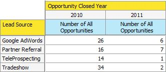

# Understanding Opportunity Analysis in Revenue Explorer {#understanding-opportunity-analysis-in-revenue-explorer}

Understanding Opportunity Analysis in Revenue Explorer - Marketo Docs - Product Documentation

Opportunity Analysis in the Revenue Explorer allows you to examine your opportunities at a deeper level. Slice and dice the data based on any lead/company attributes, such as lead source, industry or geography. Analyze opportunity creation and close based on name, stage or probability. Find out marketing contributions to the pipeline.

### What's in this article? {#what-s-in-this-article}

[Example analysis](#understandingopportunityanalysisinrevenueexplorer-exampleanalysis)  
[Opportunity Analysis Dimensions and Measures](#understandingopportunityanalysisinrevenueexplorer-opportunityanalysisdimensionsandmeasures)

#### Example analysis {#understandingopportunityanalysisinrevenueexplorer-exampleanalysis}

Here are a few reports you can create in the Opportunity Analysis area.

1. Marketing Influence on Opportunties Created

   What percentage of your company’s pipeline was influenced by your marketing programs? This report gives you the answer. The following pie charts demonstrate the percentage of the number of all opportunities and the opportunity amount that were acquired by a marketing program.

   

1. Marketing Influence on Opportunities Closed and Won
1. This report shows how much revenue was acquired and influenced by marketing, by number and amount.

   

1. Opportunity Closed by Lead Source
1. This report breaks down all the opportunities closed by lead source and gives you a clear overview of which sources are working and which aren't.

   

1. Time to Close by Source  
  
   This report demonstrates the relationship between the average days to close an opportunity and the lead source.

   

1. Open Opportunity and Stage

   This report shows how many opportunities are open in each revenue cycle stage.

   

1. Number of Opportunities by Year by Industry

   This report answers the question, "Are we getting more or fewer opportunities from certain industries year over year?"

   

#### Opportunity Analysis Dimensions and Measures {#understandingopportunityanalysisinrevenueexplorer-opportunityanalysisdimensionsandmeasures}

Opportunity Analysis gives you access to all lead, company and opportunity related dimensions and opportunity-related measures. Use these opportunity analysis dimensions and measures to answer specific questions in your report.

1. Company Attributes

   | Dimension |Description |
   |---|---|
   | Annual Revenue |Company's annual revenue |
   | City |The city where the company is located |
   | Country |The county where the company is located |
   | Industry |The industry the company is in |
   | Company Name |Name of the company |
   | Number of employees |Number of Employees in the Company |
   | Postal Code |Company's postal code |
   | SIC Code |Company's SIC Code |
   | State |The state where the company is located |

1. Lead Attributes

   | Dimension |Description |
   |---|---|
   | Blacklisted |The lead is blacklisted |
   | Converted to Opportunity |The lead is converted to an opportunity |
   | Email Invalid |Whether the lead has a valid email address |
   | Marketing Suspended |Is the lead suspended from marketing emails |
   | Email Address |Lead's email address |
   | Job Title |Lead's job title |
   | Full Name |Lead's full name |
   | Original Source Type |Lead's original source type |
   | Register Source Type |Lead's registered source type |
   | Lead Owner Email Address |Lead owner's email address |
   | Lead Owner Job Title |Lead owner's job title |
   | Lead Owner Name |Lead owner's name |
   | Lead Source |Lead source |
   | Lead Status |Lead status |

1. Lead Created Timeframe

   | Dimension |Description |
   |---|---|
   | Lead Created Year |The year when the lead is created |
   | Lead Created Quarter |The quarter when the lead is created |
   | Lead Created Month |The month when the lead is created |
   | Lead Created Week |The week when the lead is created |
   | Lead Created Date |The date when the lead is created |

1. Opportunity Attributes

   | Dimension |Description |
   |---|---|
   | Opportunity Closed |Is the opportunity closed |
   | Opportunity Forecast Category |Opportunity forecast category |
   | Opportunity Name |Opportunity name |
   | Opportunity Stage |Opportunity stage |
   | Opportunity Type |Opportunity type |
   | Opportunity Won |Is this opportunity closed and won |
   | Marketing Influenced Opportunity |This flag indicates if any of the lead/contact was acquired by or achieved success in any marketing program. Only programs that have a period cost defined are considered. |

1. Opportunity Closed Timeframe

   | Dimension |Description |
   |---|---|
   | Opportunity Closed Year |The year when the opportunity is closed |
   | Opportunity Closed Quarter |The quarter when the opportunity is closed |
   | Opportunity Closed Month |The month when the opportunity is closed |
   | Opportunity Closed Week |The week when the opportunity is closed |
   | Opportunity Closed Date |The date when the opportunity is closed |

1. Opportunity Created Timeframe

   | Dimension |Description |
   |---|---|
   | Opportunity Created Year |The year when the opportunity is created |
   | Opportunity Created Quarter |The quarter when the opportunity is created |
   | Opportunity Created Month |The month when the opportunity is created |
   | Opportunity Created Week |The week when the opportunity is created |
   | Opportunity Created Date |The date when the opportunity is created |

1. Measures

   | Measure |Description |
   |---|---|
   | Avg Days to Close Opportunity |Average number of days to close an opportunity |
   | Avg Days to Close Opportunity (Lost) |Average number of days to a lost opportunity |
   | Avg Days to Close Opportunity (Won) |Average number of days to a won opportunity |
   | Number of All Opportunities |Total number of all opportunities |
   | Number of Opportunities (Closed) |Total number of opportunities that are closed (won or lost) |
   | Number of Opportunities (Lost) |Total number of opportunities that are lost |
   | Number of Opportunities (Open) |Total number of opportunities that are still open |
   | Number of Opportunities (Won) |Total number of opportunities that are won |
   | Opportunity Amount |Total opportunity amount. If more than one lead is associated with an opportunity, allocation amount is based on lead score. |
   | Opportunity Amount (Lost) |Total amount for lost opportunities. If more than one lead is associated with an opportunity, allocation amount is based on lead score. |
   | Opportunity Amount (Open) |Total amount for open opportunities. If more than one lead is associated with an opportunity, allocation amount is based on lead score. |
   | Opportunity Amount (Won) |Total amount for won opportunities. If more than one lead is associated with an opportunity, allocation amount is based on lead score. |

>[!NOTE]
>
>**Related Articles**
>
>* [Create a Revenue Explorer Report](create-a-revenue-explorer-report.md)
>* [Adding Fields to a Revenue Explorer Report](adding-fields-to-a-revenue-explorer-report.md)
>* [Subscribe to a Revenue Explorer Report](subscribe-to-a-revenue-explorer-report.md)
>

