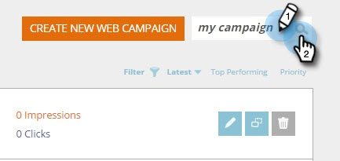

# Save your Campaign as a Template {#save-your-campaign-as-a-template}

Save your Campaign as a Template - Marketo Docs - Product Documentation

Have you ever spent time creating the perfect web campaign? You can now save it as a template for easy re-use in the future.

##### 1. Go to Web Campaigns. {#saveyourcampaignasatemplate-gotowebcampaigns}

##### 2. Search for the campaign you want to save as a template. {#saveyourcampaignasatemplate-searchforthecampaignyouwanttosaveasatemplate}

  

##### 3. Click the Edit icon. {#saveyourcampaignasatemplate-clicktheediticon}

  

##### 4. Check Use as template and click Save. {#saveyourcampaignasatemplate-checkuseastemplateandclicksave}

     

##### 5. That's it! Next time you create a campaign and select template, check My Templates in the Set Campaigns page to see the templates you saved. {#saveyourcampaignasatemplate-that'sit-nexttimeyoucreateacampaignandselecttemplate-checkmytemplatesinthesetcampaignspagetoseethetemplatesyousaved}

