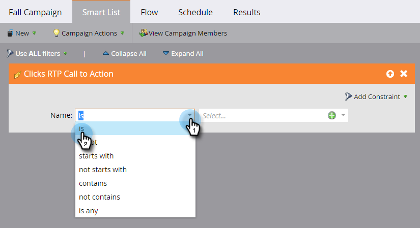

# Define a Smart List for Web Personalization Activities {#define-a-smart-list-for-web-personalization-activities}

Define a Smart List for Web Personalization Activities - Marketo Docs - Product Documentation

You can use Web Personalization activities in filters and triggers when you're defining a smart list in a smart campaign. Here, you want to capture anyone who clicked a Web Personalization call to action (campaign).

Use a trigger to send an email or alert, or change a value or a score based on visitors who clicked and engaged with a Web Personalization call to action. You can also filter and view those leads that clicked on a Web Personalization call to action.

1. In your smart campaign, click the **Smart List** tab.

   

   >[!NOTE]
   >
   >**Deep Dive**
   >
   >
   >Smart Lists can do amazing things. Learn more in the [Smart List Deep Dive](../../../../welcome-to-marketo-docs/product-docs/core-marketo-concepts/smart-campaigns/understanding-smart-campaigns.md).

1. Search for the trigger and then drag and drop the trigger onto the canvas.

   

   >[!NOTE]
   >
   >A smart campaign with triggers runs in Trigger mode. It runs on one person at a time based on events triggered and the filters added.

1. Click the drop-down and choose an operator.

   

   >[!CAUTION]
   >
   >Red squiggly lines indicate an error. If not corrected, it makes the campaign invalid and it will not run.

1. Define the trigger.

   

1. Add filters as needed.

   

   >[!TIP]
   >
   >In a smart campaign with both triggers and filters, the triggers go at the top. When triggered, only people who satisfy the filter criteria will go through the flow.

   >[!NOTE]
   >
   >With multiple triggers, a person goes through to the flow if ANY one of the triggers gets activated.

   [Define Smart List for Smart Campaign | Batch](../../../../welcome-to-marketo-docs/product-docs/core-marketo-concepts/smart-campaigns/creating-a-smart-campaign/define-smart-list-for-smart-campaign-|-batch.md)

   >[!NOTE]
   >
   >**Related Articles**
   >
   >    
   >    
   >    * [Define Smart List for Smart Campaign | Batch](../../../../welcome-to-marketo-docs/product-docs/core-marketo-concepts/smart-campaigns/creating-a-smart-campaign/define-smart-list-for-smart-campaign-|-batch.md)
   >    * [Add a Flow Step to a Smart Campaign](../../../../welcome-to-marketo-docs/product-docs/core-marketo-concepts/smart-campaigns/flow-actions/add-a-flow-step-to-a-smart-campaign.md)
   >    * [Define a Smart List for Predictive Content Activities](../../../../welcome-to-marketo-docs/product-docs/predictive-content/define-a-smart-list-for-predictive-content-activities.md)
   >    
   >

To run the campaign on a set of people all at the same time, learn how to . 