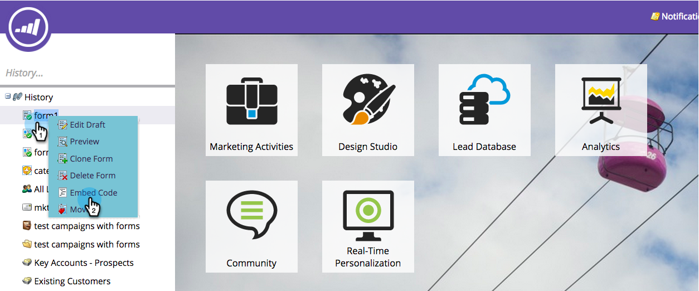
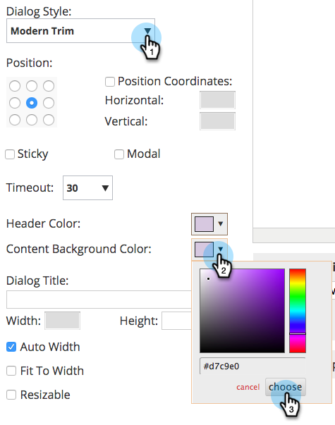
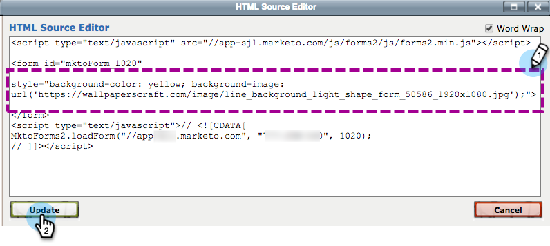

# Embed a Form into a Web Campaign {#embed-a-form-into-a-web-campaign}

Embed a Form into a Web Campaign - Marketo Docs - Product Documentation

See how you can embed a Marketo form into a web campaign (Dialog, In Zone or Widget).

1. Right-click on an approved form. Select **Embed Code**.

   ** 

   **

1. Copy the Code.

   

1. In Web Personalization, go to **Web Campaigns**.

   

1. Click **Create New Campaign**.

   ** 

   **

1. In the Rich Text Editor, click the HTML icon.

   

1. Paste the form embed code into the HTML Source Editor. Click **Update**.

   

1. The form will not display in the editor view, but you can preview it to see how it will render in a campaign.
1. Click **Launch** to start the campaign.

   >[!NOTE]
   >
   >Any changes to the form's fields must be done within Marketo's Marketing Activities in Edit Draft of the Form.

#### Three Ways to Add a Background Image to a Form {#embedaformintoawebcampaign-threewaystoaddabackgroundimagetoaform}

To add a background image to your form you can:

* Edit the CSS of a Form Theme
* Change the dialog or widget colors in Set Campaign
* Add CSS code to the script

To edit the CSS of a Form Theme, see [this article](../../../../welcome-to-marketo-docs/product-docs/demand-generation/forms/form-design/edit-the-css-of-a-form-theme.md).

To change the dialog or widget colors in Set Campaign:

1. In the Rich Text Editor, select a Dialog campaign type and a dialog style, header color and background color to customize the form's background colors. Click **Save**.

   

1. Here's an example of how a Modern Trim Dialog Style looks with a light purple header and background color.

   

To add CSS code to the script:

1. In the Rich Text Editor, click the HTML icon.

   

1. Paste the form embed code with the background style code into the HTML Source Editor. Click **Update**.

   

1. Click **Preview** it to see how it will render in a campaign (the form will not display in the editor view). Here's an example of how the form code above renders in a campaign with a background image.

   

>[!NOTE]
>
>**Related Articles**
>
>* [Edit the CSS of a Form Theme](https://docs.marketo.com/display/public/DOCS/Edit+the+CSS+of+a+Form+Theme)
>* [Show Thank You Message Without a Follow-Up Landing Page](http://developers.marketo.com/blog/show-thank-you-message-without-a-follow-up-landing-page/)
>* [Forms 2.0](http://developers.marketo.com/documentation/websites/forms-2-0/)
>

