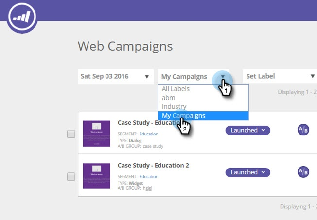

# View Web Campaigns from a Specific Label {#view-web-campaigns-from-a-specific-label}

View Web Campaigns from a Specific Label - Marketo Docs - Product Documentation

Looking to view and filter your campaigns according to a specific label?

#### Filter by existing labels {#viewwebcampaignsfromaspecificlabel-filterbyexistinglabels}

1. Go to **Web** **Campaigns**.

   

1. Under the labels drop-down, select the label you want.

   

1. Notice now we only show you the campaigns that are associated to the selected label?

   

>[!NOTE]
>
>**Related Articles**
>
>* [Label Your Web Campaigns](label-your-web-campaigns.md)
>* [View Segments from a Specific Label](../../../../welcome-to-marketo-docs/product-docs/web-personalization/using-web-segments/view-segments-from-a-specific-label.md)
>* [Label your Segments](../../../../welcome-to-marketo-docs/product-docs/web-personalization/using-web-segments/label-your-segment.md)
>

