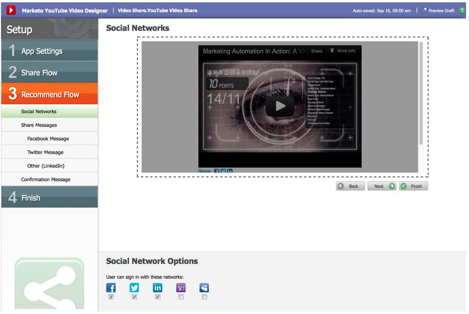

# Release Notes: September 2012 {#release-notes-september}

Release Notes: September 2012 - Marketo Docs - Product Documentation

This release includes highly anticipated, integrated social features and lead management goodies! Note: social features are available as an add-on or as part of selected bundles.

### What's in this article? {#what-s-in-this-article}

[Publish a YouTube Video with Social Sharing](#releasenotes-september2012-publishayoutubevideowithsocialsharing)  
[Add a Share Button](#releasenotes-september2012-addasharebutton)  
[Social Sign-On](#releasenotes-september2012-socialsign-on)  
[Publish Landing Pages to Facebook](#releasenotes-september2012-publishlandingpagestofacebook)  
[ReadyTalk Event Adapter](#releasenotes-september2012-readytalkeventadapter)  
[Microsoft Dynamics On Premise](#releasenotes-september2012-microsoftdynamicsonpremise)  
[Webhooks (Treasure Chest)](#releasenotes-september2012-webhooks-treasurechest)  
[Update to getMultipleLeads API](#releasenotes-september2012-updatetogetmultipleleadsapi)

#### Publish a YouTube Video with Social Sharing {#releasenotes-september2012-publishayoutubevideowithsocialsharing}

Amplify the audience for your videos by encouraging your visitors to share them socially, using the new Video Share on your landing pages.

#### Add a Share Button {#releasenotes-september2012-addasharebutton}

Fully customize share messages and appearance of a new set of social sharing buttons. Additionally, capture social profile data as your leads share your content.

#### Social Sign-On {#releasenotes-september2012-socialsign-on}

Gain insight and reduce friction by allowing leads to prefill forms with information from their social networks.

#### Publish Landing Pages to Facebook {#releasenotes-september2012-publishlandingpagestofacebook}

Extend the reach of your landing pages by publishing them directly into Facebook, complete with social apps, forms, and the full functionality of Marketo’s landing pages.

#### ReadyTalk Event Adapter {#releasenotes-september2012-readytalkeventadapter}

Seamlessly connect a Marketo event to a ReadyTalk meeting. Use a Marketo form to capture registrants and automatically register them in ReadyTalk. A bi-directional sync allows attendance information to populate into Marketo.

#### Microsoft Dynamics On Premise {#releasenotes-september2012-microsoftdynamicsonpremise}

We now support Microsoft Dynamics 2011 on-premise with an Internet-Facing deployment.

#### Webhooks (Treasure Chest) {#releasenotes-september2012-webhooks-treasurechest}

A Webhook is a user-defined HTTP callback. It’s a great way to push data from Marketo to any other service. This feature is currently available in the Treasure Chest and is only supported in trigger campaigns at this time.

Examples of how you might use Webhooks include: posting username and password information to another system to create a trial account; sending an SMS text message when you get a new lead.

#### Update to getMultipleLeads API {#releasenotes-september2012-updatetogetmultipleleadsapi}

We’ve added new filtering criteria to the getMultipleLeads API call. In addition to filtering by date, we now support additional criteria:

* Date Ranges
* Static List Names
* Arrays of Lead Keys

