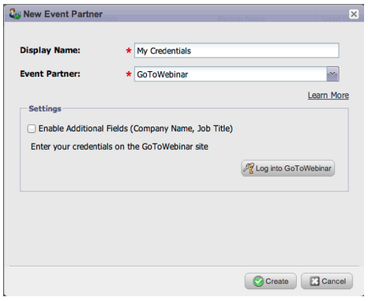

# Release Notes: September 2013 {#release-notes-september}

Release Notes: September 2013 - Marketo Docs - Product Documentation

The following features are included in the September release. Please check your [Marketo Edition](http://docs.marketo.com/display/docs/assets/pricing.php) for feature availability.

After the release, be sure to check out the [New Release](release-notes-december-2013.md) tab in the Community for detailed Knowledge Base articles for each feature!

### What's in this article? {#what-s-in-this-article}

[Shorter URLs](#releasenotes-september2013-shorterurls)  
[Change Send Test to Send Sample](#releasenotes-september2013-changesendtesttosendsample)  
[Personalized Send Sample Email](#releasenotes-september2013-personalizedsendsampleemail)  
[Additional Field Sync for GoToWebinar](#releasenotes-september2013-additionalfieldsyncforgotowebinar)  
[Restrict User Login to SSO only](#releasenotes-september2013-restrictuserlogintossoonly)  
[Virus Scan of Uploaded Files](#releasenotes-september2013-virusscanofuploadedfiles)  
[Export Opportunity Influence Analyzer](#releasenotes-september2013-exportopportunityinfluenceanalyzer)  
[Program Attribution Settings](#releasenotes-september2013-programattributionsettings)  
[Sales Insight available in French and German (Salesforce only)](#releasenotes-september2013-salesinsightavailableinfrenchandgerman-salesforceonly)  
[Cobalt User Interface](#releasenotes-september2013-cobaltuserinterface)

#### Shorter URLs {#releasenotes-september2013-shorterurls}

Email URLs have been given a trim to be click friendly to the recipient, while preserving all tracking functionality

>[!CAUTION]
>
>As we switch over to Short URLs, links in emails sent out prior to the September release, will expire 90 days after this release.

Use data from Marketo custom objects or add conditional logic to your email content using the Velocity template language.

#### Change Send Test to Send Sample {#releasenotes-september2013-changesendtesttosendsample}

We have renamed the action Send Test to be Send Sample

#### Personalized Send Sample Email {#releasenotes-september2013-personalizedsendsampleemail}

When you send an email sample, you can select the name of a lead to personalize the sample email.

#### Additional Field Sync for GoToWebinar {#releasenotes-september2013-additionalfieldsyncforgotowebinar}

You can sync Company Name and Job Title from your Marketo form to GoToWebinar. To enable these additional fields, go to Event Partners and check “Enable Additional Fields.”

#### Restrict User Login to SSO only {#releasenotes-september2013-restrictuserlogintossoonly}

Configure subscriptions to only allow Marketo Users to log in through SSO and not through the normal login screen

#### Virus Scan of Uploaded Files {#releasenotes-september2013-virusscanofuploadedfiles}

Files uploaded to the Design Studio are now automatically scanned and blocked if the files contain viruses

#### Export Opportunity Influence Analyzer {#releasenotes-september2013-exportopportunityinfluenceanalyzer}

You can now export the data in the Opportunity Influence Analyzer to Excel. Each exported Excel file contains all the marketing interactions for all leads (including those without a role in the opportunity) as well all the opportunities under the selected account in the analyzer. The opportunity rows are highlighted in green. You can use Excel’s native data filtering capabilities if you need to focus on specific leads or marketing activities.

#### Program Attribution Settings {#releasenotes-september2013-programattributionsettings}

You can change the way Marketo ties contacts and opportunities for first and multi touch attribution metrics, including the ability to do account-based attribution. These settings will impact attribution metrics in Revenue Explorer reports under the Program Opportunity Analysis area and the Opportunity Analysis area. This will also affect the attribution metrics in Program Analyzer.

You can change the program attribution settings to one of three choices. Changing this setting does not modify any Marketo or CRM data; it simply changes the way your reports run and it can be reverted at any time.

The Explicit setting will only examine contacts with roles (current behavior). Implicit will examine all contacts associated to the account regardless of role. We strongly recommend using the Explicit mode if possible. Using Implicit may create false positives, people with credit for an opportunity despite having no real influence in the opportunity.

#### Sales Insight available in French and German (Salesforce only) {#releasenotes-september2013-salesinsightavailableinfrenchandgerman-salesforceonly}

Download the latest version of Marketo Lead Management and Marketo Sales Insight from AppExchange so your French and German salespeople can see Sales Insight content in their preferred language.

#### Cobalt User Interface {#releasenotes-september2013-cobaltuserinterface}

Over the next few months, a new theme is being rolled out in different parts of the application. This month, you may notice more new blue modal windows.
