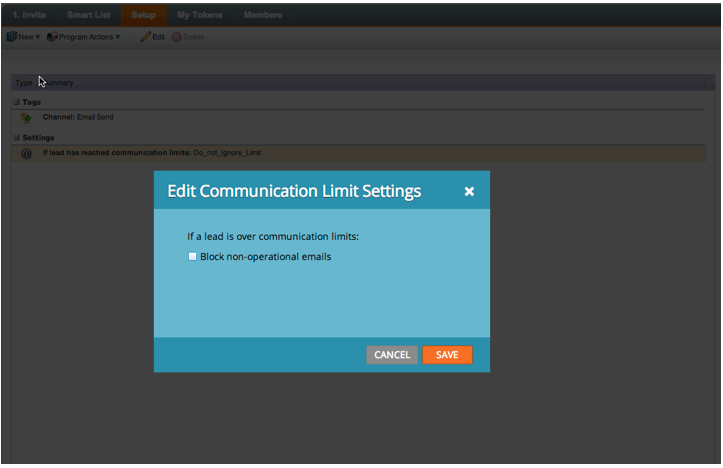

# Release Notes: January 2014 {#release-notes-january}

Release Notes: January 2014 - Marketo Docs - Product Documentation

The following features are included in the January 2014 release. Please check your [Marketo Edition](http://www.marketo.com/pricing/) for feature availability.

### What's in this article? {#what-s-in-this-article}

[Forms 2.0](#releasenotes-january2014-forms2-0)  
[Communication Limits for Email Program](#releasenotes-january2014-communicationlimitsforemailprogram)  
[Additional Fields in Program Membership Analysis](#releasenotes-january2014-additionalfieldsinprogrammembershipanalysis)

#### Forms 2.0 {#releasenotes-january2014-forms2-0}

Heads up: Documentation for Forms 2.0 is coming soon. In the meantime, learn more below, and in the [intro video](../../../welcome-to-marketo-docs/product-docs/demand-generation/forms.md)!

Take control of the form creation process and give your web developers a break. [Forms](../../../welcome-to-marketo-docs/product-docs/demand-generation/forms.md) 2.0 are designed to empower Marketers to create both visually and functionally robust forms without needing programming knowledge.

**Give Your Forms the Visual Makeover They Deserve:**

Theme designs, button customization, and flexible layouts enable you to design modern looking forms that’ll fit right in with your site’s look and feel.

**Conditional Visibility and Follow-up page Logic:**

   
Want “State” to only show up if a user selects USA as their “Country”? How about presenting different whitepapers to customers based on how they answer questions on your form? Build conditional logic into your forms right from the editor. No javascript required!

**Easily Embed Forms on your own landing pages:**

Gone are the days of lifting html code from forms placed on Marketo landing pages and dropping them in an iFrame. Simply grab the embed code and place it on your landing page where you want the form to render. Two modes -normal and lightbox- give you even more flexibility with Marketo forms on your site.

Learn more from the [Forms 2.0 intro video](../../../welcome-to-marketo-docs/product-docs/demand-generation/forms.md). (Documentation coming to the [Forms](../../../welcome-to-marketo-docs/product-docs/demand-generation/forms.md) deep dive soon!)

#### Communication Limits for Email Program {#releasenotes-january2014-communicationlimitsforemailprogram}

[Set Communication Limits on an email program](../../../welcome-to-marketo-docs/product-docs/email-marketing/email-programs/email-program-actions/enable-disable-communication-limits-in-an-email-program.md) to ensure you do not over-communicate to your database. If a person is over the limit defined, she will not receive the email.

#### Additional Fields in Program Membership Analysis {#releasenotes-january2014-additionalfieldsinprogrammembershipanalysis}

Now you can add and group your [Program Membership Analysis](../../../welcome-to-marketo-docs/product-docs/reporting/revenue-cycle-analytics/program-analytics/build-a-program-membership-analysis-report-that-lists-leads.md) metrics by lead and company attributes. For example, you can add the Industry field to see the split of your program members and successes.

