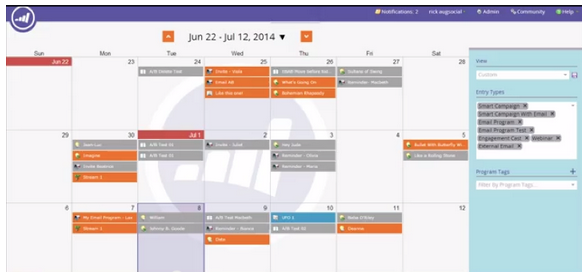
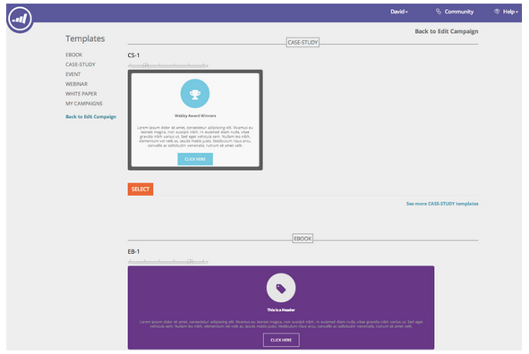

# Release Notes: July 2014 {#release-notes-july}

Release Notes: July 2014 - Marketo Docs - Product Documentation

The following features are included in the July 2014 release. Please check your Marketo Edition for feature availability. Come back after the release for links to detailed feature documentation.

### What's in this article? {#what-s-in-this-article}

[Marketing Calendar](#releasenotes-july2014-marketingcalendar)  
[New Look and Feel](#releasenotes-july2014-newlookandfeel)  
[Date Operators](#releasenotes-july2014-dateoperators)  
[Program Schedule View](#releasenotes-july2014-programscheduleview)  
[List Operations in the ReST API](#releasenotes-july2014-listoperationsintherestapi)  
[Fast List Import](#releasenotes-july2014-fastlistimport)  
[New Improved Munchkin!](#releasenotes-july2014-newimprovedmunchkin)  
[RTP: Real-Time Personalization Campaign Templates](#releasenotes-july2014-rtp-real-timepersonalizationcampaigntemplates)  
[RTP: JavaScript API Enhancements](#releasenotes-july2014-rtp-javascriptapienhancements)  
[RTP: HTML5 support in Campaign Content Editor](#releasenotes-july2014-rtp-html5supportincampaigncontenteditor)

#### Marketing Calendar {#releasenotes-july2014-marketingcalendar}

See all of your events, emails and more across programs. [This new product](../../../welcome-to-marketo-docs/product-docs/core-marketo-concepts.md) will be available at no charge to customers with 10 or fewer Marketo Lead Management or Dialog users.

Documentation on the Marketing Calendar will be available at release time.

#### New Look and Feel {#releasenotes-july2014-newlookandfeel}

Marketo Lead Management will be updated with a new look and feel that is modern and sleek, and includes an updated navigation.

#### Date Operators {#releasenotes-july2014-dateoperators}

[Advanced filters](../../../welcome-to-marketo-docs/product-docs/core-marketo-concepts/smart-lists-and-static-lists/creating-a-smart-list/smart-list-filter-operators-glossary.md) for “in past before”, “in future”, and “in future after”. For example, find leads that have a birth date in the next 3 months, or a contract that is expiring after 6 months.

#### Program Schedule View {#releasenotes-july2014-programscheduleview}

In addition to the marketing calendar you manage your events and default programs with, a [new schedule view](../../../welcome-to-marketo-docs/product-docs/core-marketo-concepts/programs.md) right on the program.

* Reschedule all dates at once
* New Tentative Dates – pencil it in!
* Custom Entry types – ToDo, Press Release, anything you want

#### List Operations in the ReST API {#releasenotes-july2014-listoperationsintherestapi}

We’ve added the calls below related to list operations in ReST. See [developers.marketo.com](http://developers.marketo.com/documentation/rest/) for the full documentation.

* Get List By ID
* Get Multiple Lists
* Import to List
* Get Import to List Status

#### Fast List Import {#releasenotes-july2014-fastlistimport}

Over **50x faster**, your files will zoom into Marketo! The old “Normal” and “Optimized for New Leads” import options have been replaced with “Default (Fast Import)”.

The “Skip New Leads and Updates” option remains unchanged.

#### New Improved Munchkin! {#releasenotes-july2014-newimprovedmunchkin}

Rollout will be staged starting in mid-July and continuing for the next several months.

* Removes the dependency jQuery for full and future compatibility
* More compatible with other JavaScript on your site
* Fully tested on many sites over the past year!

#### RTP: Real-Time Personalization Campaign Templates {#releasenotes-july2014-rtp-real-timepersonalizationcampaigntemplates}

The RTP Set Campaign page now [includes ready-made templates](../../../welcome-to-marketo-docs/product-docs/web-personalization/using-templates/using-templates-to-create-web-campaigns.md). Choose from a variety of styles including webinars, case studies, ebooks.

#### RTP: JavaScript API Enhancements {#releasenotes-july2014-rtp-javascriptapienhancements}

New RTP API call to get real-time visitor data such as organization, industry, location and segment code match. In addition, hovering over a segment name in the Segments page will reveal a tooltip showing the segment code. See our [developers site](http://developers.marketo.com/documentation/websites/rtp-js-api/) for full documentation.

#### RTP: HTML5 support in Campaign Content Editor {#releasenotes-july2014-rtp-html5supportincampaigncontenteditor}

The content WYSIWYG editor in the Set Campaigns page now has full HTML5 compatibility. Click on the “HTML” icon within the editor to insert any HTML5 code.

Check out all our [previous releases](../../../welcome-to-marketo-docs/release-notes.md).
[Careers](http://marketo.jobs/) [Legal](http://docs.marketo.com/display/docs/assets/legal.php) [Privacy](http://docs.marketo.com/display/docs/assets/privacy.php)   
© 201 