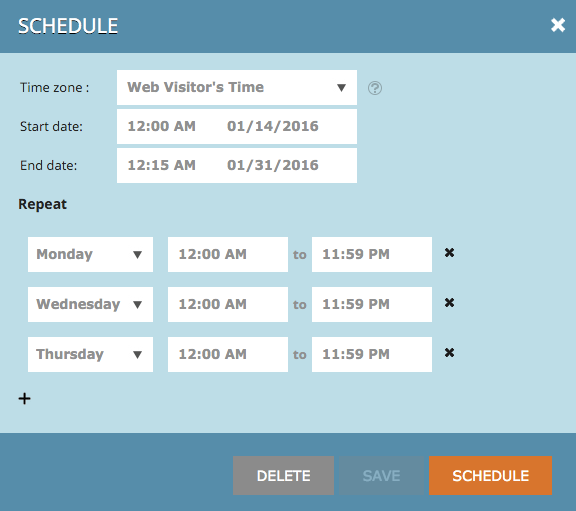

# Release Notes: Winter '16 {#release-notes-winter}

Release Notes: Winter '16 - Marketo Docs - Product Documentation

The following features are included in the Winter '16 release. Please click the title links to view detailed articles for each feature.

### What's in this article? {#what-s-in-this-article}

[Is Anonymous Filter](#releasenotes-winter'16-isanonymousfilter)  
[Database Dashboard](#releasenotes-winter'16)  
[Microsoft Edge Browser](#releasenotes-winter'16-microsoftedgebrowser)  
[Microsoft Outlook 2016](#releasenotes-winter'16-microsoftoutlook2016)  
[Email Program Head Start](#releasenotes-winter'16-emailprogramheadstart)  
[Mobile Marketing Enhancements](#releasenotes-winter'16-mobilemarketingenhancements)  
[Program API](#releasenotes-winter'16-programapi)  
[Microsoft Dynamics Enhancements](#releasenotes-winter'16-microsoftdynamicsenhancements)  
[Custom Objects Enhancements](#releasenotes-winter'16-customobjectsenhancements)  
[Facebook Lead Ads](#releasenotes-winter'16-facebookleadads)  
[Web (Real-Time Personalization) Campaign Scheduler](#releasenotes-winter'16-web-real-timepersonalization-campaignscheduler)

#### [Is Anonymous Filter](../../../welcome-to-marketo-docs/product-docs/administration/additional-integrations/add-munchkin-tracking-code-to-your-website/next-generation-munchkin-tracking-faq.md) {#releasenotes-winter'16-isanonymousfilter}

The Is Anonymous filter has been removed for Smart Lists. See the [Next Generation Munchkin Tracking FAQ](../../../welcome-to-marketo-docs/product-docs/administration/additional-integrations/add-munchkin-tracking-code-to-your-website/next-generation-munchkin-tracking-faq.md) document for details. This change does not affect Web Personalization (RTP), which continues to identify anonymous and known web visitors and personalize content in real time to these visitors.

#### [Database Dashboard](../../../welcome-to-marketo-docs/product-docs/core-marketo-concepts/smart-lists-and-static-lists/managing-people-in-smart-lists/database-dashboard.md)  {#releasenotes-winter'16}

The Lead Database has an updated Summary Dashboard that includes total people database size, number of marketable leads, and a breakdown of leads by top five sources.

#### [Microsoft Edge Browser](../../../welcome-to-marketo-docs/product-docs/administration/setup-(administration)/supported-browsers.md) {#releasenotes-winter'16-microsoftedgebrowser}

We've added Microsoft Edge to the [list of browsers](https://docs.marketo.com/display/public/DOCS/Supported+Browsers) supported by Marketo.

#### [Microsoft Outlook 2016](../../../welcome-to-marketo-docs/product-docs/marketo-sales-insight/msi-outlook-plugin/install-the-marketo-email-add-in-for-outlook-with-a-registration-code.md) {#releasenotes-winter'16-microsoftoutlook2016}

[Microsoft Outlook 2016](../../../welcome-to-marketo-docs/product-docs/marketo-sales-insight/msi-outlook-plugin/install-the-marketo-email-add-in-for-outlook-with-a-registration-code.md) is now supported.

#### [Email Program Head Start](../../../welcome-to-marketo-docs/product-docs/email-marketing/email-programs/email-program-actions/head-start-for-email-programs.md) {#releasenotes-winter'16-emailprogramheadstart}

Use Head Start to indicate that processing for your send should occur ahead of time. Instead of qualifying leads and preparing emails at the scheduled time of the program, Head Start ensures that these tasks are done beforehand. This way, your audience will start receiving emails at the scheduled time.

To use this feature, the email program must be scheduled at least 12 hours in advance and the Smart List will be locked 12 hours prior to the send.

>[!NOTE]
>
>This feature will roll out gradually for a week following the Winter '16 Release. It is unavailable for use with smart campaigns or the API.

#### [Mobile Marketing Enhancements](../../../welcome-to-marketo-docs/product-docs/mobile-marketing/admin-(mobile-marketing)/add-a-mobile-app.md) {#releasenotes-winter'16-mobilemarketingenhancements}

**PhoneGap Support:** We now offer PhoneGap support for your mobile app. [Learn more](http://developers.marketo.com/documentation/mobile/phonegap-plugin/).

**Support for Sandbox Apps**:

#### [Program API](http://developers.marketo.com/documentation/programs/) {#releasenotes-winter'16-programapi}

Create, update, and clone programs via the REST API. This does not include the creation or updating of smart lists and smart campaigns within a program.

#### [Microsoft Dynamics Enhancements](../../../welcome-to-marketo-docs/product-docs/crm-sync/microsoft-dynamics-sync/microsoft-dynamics-sync-details/sync-status.md) {#releasenotes-winter'16-microsoftdynamicsenhancements}

** [Sync Status](../../../welcome-to-marketo-docs/product-docs/crm-sync/microsoft-dynamics-sync/microsoft-dynamics-sync-details/sync-status.md):** Keep tabs on the current throughput and backlog of the sync process. Break it down by the count of inserts and updates by object.

** [Notifications](../../../welcome-to-marketo-docs/product-docs/core-marketo-concepts/miscellaneous/understanding-notifications/notification-types.md)**: Get notified for common sync errors, along with a list of leads that have that error.

#### [Custom Objects Enhancements](../../../welcome-to-marketo-docs/product-docs/administration/marketo-custom-objects/create-marketo-custom-objects.md)  {#releasenotes-winter'16-customobjectsenhancements}

You now can create many-to-many relationships between Leads/Accounts and a custom object by using an intermediary object with multiple link fields.

#### [Facebook Lead Ads](../../../welcome-to-marketo-docs/product-docs/demand-generation/facebook/set-up-facebook-lead-ads.md) {#releasenotes-winter'16-facebookleadads}

[Facebook Lead ads](https://www.facebook.com/business/a/lead-ads) are a more direct way for a business to run lead generation campaigns on Facebook. People fill out a form to express interest in a product or service, so the business can follow up with them. The Marketo integration with Facebook Lead Ads automatically captures the information a lead provides within the Lead Ad form. Follow up actions and notifications can then be automated using the new Fills Out Facebook Lead Ads trigger.

#### [Web (Real-Time Personalization) Campaign Scheduler](../../../welcome-to-marketo-docs/product-docs/web-personalization/working-with-web-campaigns/schedule-a-web-campaign.md) {#releasenotes-winter'16-web-real-timepersonalization-campaignscheduler}

Schedule your campaign in advance. Set up a start and end date for personalized web content and repeat campaigns on specific days and times. Personalize the schedule to display the campaign according to the web visitor's time or a selected time zone.

