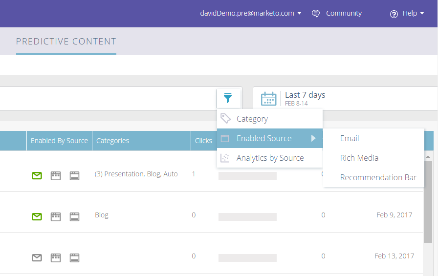

# Release Notes: Winter '17 {#release-notes-winter}

Release Notes: Winter '17 - Marketo Docs - Product Documentation

The following features are included in the Winter '17 release. Check your Marketo edition for feature availability.

Please click the title links to view detailed articles for each feature**. Note: **If a topic has multiple subheadings, the links are placed there.

### What's in this article? {#what-s-in-this-article}

[Advanced Matching for Facebook Custom Audiences](#releasenotes-winter'17-advancedmatchingforfacebookcustomaudiences)  
[Custom Object Import API](#releasenotes-winter'17-customobjectimportapi)  
[Web Personalization Campaigns Export](#releasenotes-winter'17-webpersonalizationcampaignsexport)  
[Localization](#releasenotes-winter'17-localization)  
[Account Based Marketing Enhancements](#releasenotes-winter'17-accountbasedmarketingenhancements)  
[Predictive Content Enhancements](#releasenotes-winter'17-predictivecontentenhancements)  
[SDK Enhancements](#releasenotes-winter'17-sdkenhancements)  
[Vibes SMS LaunchPoint Integration](#releasenotes-winter'17-vibessmslaunchpointintegration)  
[Legacy Rich Text Editor and Form Editor 1.0 Deprecation](#releasenotes-winter'17-legacyrichtexteditorandformeditor1-0deprecation)  
[Marketo Activity APIs](#releasenotes-winter'17-marketoactivityapis)

#### [Advanced Matching for Facebook Custom Audiences](../../../welcome-to-marketo-docs/product-docs/demand-generation/ad-network-integrations/add-facebook-custom-audiences-as-a-launchpoint-service.md) {#releasenotes-winter'17-advancedmatchingforfacebookcustomaudiences}

Basic Matching uses email addresses only, but new Advanced Matching uses an additional seven fields, increasing the match rate for more conversion.

#### [Custom Object Import API](http://developers.marketo.com/rest-api/lead-database/custom-objects/) {#releasenotes-winter'17-customobjectimportapi}

This API provides a faster interface to synchronize custom objects into Marketo. You can import CSV, TSV, or SSV spreadsheet files into Marketo as custom objects.

#### [Web Personalization Campaigns Export](../../../welcome-to-marketo-docs/product-docs/web-personalization/working-with-web-campaigns/export-web-campaign-data.md) {#releasenotes-winter'17-webpersonalizationcampaignsexport}

Export all of your Web Campaign details and analytics in a CSV format. You then can view your data in a convenient layout.

#### [Localization](../../../welcome-to-marketo-docs/product-docs/web-personalization.md) {#releasenotes-winter'17-localization}

The Web Personalization, Predictive Content, and Email Insights apps are now available in Japanese, German, and Spanish. You [select your language and locale](../../../welcome-to-marketo-docs/product-docs/administration/settings/select-your-language-locale-and-time-zone.md) to view your content in these languages.

#### Account Based Marketing Enhancements {#releasenotes-winter'17-accountbasedmarketingenhancements}

** [Import Named Accounts](../../../welcome-to-marketo-docs/product-docs/account-based-marketing/target/named-accounts/import-named-accounts.md)**

With the Named Account Import option, create or update multiple records at once via CSV upload.

** [Email Insights Support](../../../welcome-to-marketo-docs/product-docs/reporting/email-insights/filtering-in-email-insights.md)**

Use Named Account or Account List as dimensions in Email Insights.

#### Predictive Content Enhancements {#releasenotes-winter'17-predictivecontentenhancements}

** [Filter by Enabled Source](../../../welcome-to-marketo-docs/product-docs/predictive-content/working-with-predictive-content/understanding-predictive-content.md)**

Filter Predictive Content pieces that are enabled for Email, Rich Media, or the Recommendation Bar.

** [Filter Analytics by Source](../../../welcome-to-marketo-docs/product-docs/predictive-content/working-with-predictive-content/understanding-predictive-content.md)**

Filter Predictive Content analytics for specific sources — Email, Rich Media, or Recommendation Bar.

** [Predictive Content Editor](../../../welcome-to-marketo-docs/product-docs/predictive-content/working-with-predictive-content/edit-predictive-content.md)**

There's an improved editing experience and layout that splits content preparation by source — Email, Rich Media, or Recommendation Bar.

** [Auto-Discovery Content for Predictive](../../../welcome-to-marketo-docs/product-docs/predictive-content/getting-started-(predictive-content-and-content-ai)/enable-content-discovery.md)**

Image URL and metadata are now used in the content auto-discovery process.

#### [SDK Enhancements](http://developers.marketo.com/mobile/) {#releasenotes-winter'17-sdkenhancements}

Developers now have additional control over the delivery of Push Notifications with the addition of a new SDK API call that allows developers to remove push tokens.

#### [Vibes SMS LaunchPoint Integration](../../../welcome-to-marketo-docs/product-docs/mobile-marketing/vibes-sms-messages/use-vibes-sms-messages-in-smart-list-triggers-and-filters.md) {#releasenotes-winter'17-vibessmslaunchpointintegration}

Improve your targeting with a new filter option, "Member of Vibes List."

#### [Legacy Rich Text Editor and Form Editor 1.0 Deprecation](https://nation.marketo.com/docs/DOC-4315) {#releasenotes-winter'17-legacyrichtexteditorandformeditor1-0deprecation}

Starting August 1, 2017, customers still using the legacy Rich Text Editor and Form Editor 1.0 will be automatically transitioned to the new experience.

#### [Marketo Activity APIs](https://developers.marketo.com/blog/important-change-activity-records-marketo-apis/) {#releasenotes-winter'17-marketoactivityapis}

An important change is coming to Marketo's activity APIs. Are you prepared?
