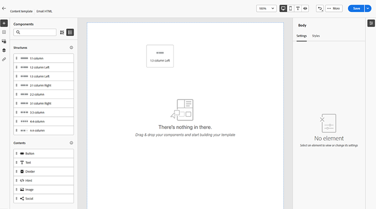

# Content authoring - components

1. To start creating or modifying content, drag and drop an item from Structures onto the canvas. Edit its settings in the pane on the right.

   >[!TIP]
   >
   >Select the n:n column component to define the number of columns of your choice (between three and 10). You can also define the width of each column by moving the arrows below the column.

   

   >[!NOTE]
   >
   >Each column size cannot be less than 10% of the total width of the structure component. Only empty columns can be removed.

1. From the Contents section, drag over desired items and drop them into one or more structure components.

   

1. Each component can be customized via the Settings or Style tabs. Change the font, text style, margin, and more.
