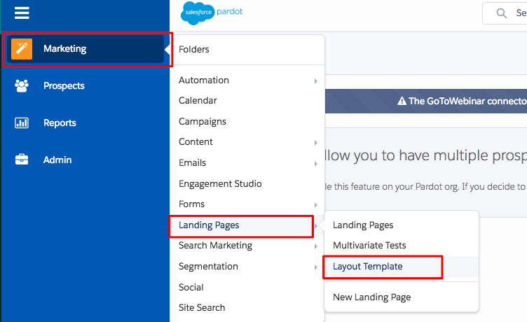
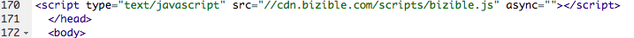

# Adding Bizible JavaScript to Pardot {#adding-bizible-javascript-to-pardot}

Adding Bizible JavaScript to Pardot - Bizible - Product Documentation

Pardot forms require additional handling within the form template beyond putting script on the site in order for Bizible to recognize form submissions. The process is simple; it only requires placing the Bizible tracking script into the Pardot form template.

#### Step by Step Instructions {#addingbiziblejavascripttopardot-stepbystepinstructions}

Once you've logged into your Pardot account, follow these steps.

##### 1. Navigate to Marketing. {#addingbiziblejavascripttopardot-navigatetomarketing.}

##### 2. Click on Landing Pages. {#addingbiziblejavascripttopardot-clickonlandingpages.}

##### 3. Select Layout Template. {#addingbiziblejavascripttopardot-selectlayouttemplate.}

##### 4. Determine the appropriate Layout Template and click Edit to the right. {#addingbiziblejavascripttopardot-determinetheappropriatelayouttemplateandclickedittotheright.}

##### 5. Copy and paste the Bizible JavaScript code right before the close header tag on your HTML page. {#addingbiziblejavascripttopardot-copyandpastethebiziblejavascriptcoderightbeforethecloseheadertagonyourhtmlpage.}

**

##### 6. Follow these steps for all applicable Landing Page Layout Templates. {#addingbiziblejavascripttopardot-followthesestepsforallapplicablelandingpagelayouttemplates.}

##### 7. Make sure the Bizible JavaScript is on the general site page as well. {#addingbiziblejavascripttopardot-makesurethebiziblejavascriptisonthegeneralsitepageaswell.}

Within the Pardot Layout Template, the code will look something like this:   

#### Additional Notes {#addingbiziblejavascripttopardot-additionalnotes}

If the Pardot IFrame has the following HTML tag:

*<base href=" `http://go.pardot.com`">*

**And** the IFrame itself is actually on a secure page (HTTPS) instead of a nonsecure page (HTTP), when we try to load our script on the Pardot IFrame, the browser will try to load an HTTP version of our script on an HTTPS page which will fail and prevent us from tracking. The solution is to update the script on the Pardot IFrame to load the secure version of our script:

**

As well, there may already be other tracking code snippets in this area, such as a Google Analytics code. Be sure to separate them by a semicolon (;) and a single space, like shown in this example:

*;*

