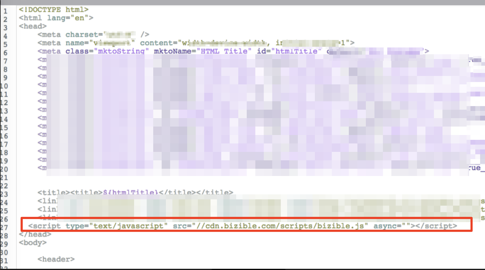

# Adding Bizible to Marketo Landing Pages {#adding-bizible-to-marketo-landing-pages}

Adding Bizible to Marketo Landing Pages - Bizible - Product Documentation

Learn how to add tracking to Marketo Landing Pages as they require additional handling. Bizible JavaScript needs to be in place on both the Landing Page and the Marketo form itself. To do this you will need to load the Bizible JavaScript into Marketo as explained in the following directions.

>[!NOTE]
>
>If you are deploying the JavaScript through a tag management provider such as Google Tag Manager, you do not need to manually add Bizible JS to Marketo.

#### How to add Bizible Script to Marketo Landing Pages {#addingbizibletomarketolandingpages-howtoaddbiziblescripttomarketolandingpages}

##### 1. Log-in to your Marketo account. {#addingbizibletomarketolandingpages-log-intoyourmarketoaccount.}

##### 2. Select your landing page and click Edit Draft. {#addingbizibletomarketolandingpages-selectyourlandingpageandclickeditdraft.}

##### 3. Drag in the HTML element. {#addingbizibletomarketolandingpages-draginthehtmlelement.}

##### 4. Enter the Bizible JavaScript into the head section: {#addingbizibletomarketolandingpages-enterthebiziblejavascriptintotheheadsection-}

* **
* Example in screenshot below

##### 5. Click Save. {#addingbizibletomarketolandingpages-clicksave.}

#### Additional Notes {#addingbizibletomarketolandingpages-additionalnotes}

* You might already have other tracking code snippets in place, such as a Google Analytics code. There is no problem with this, just be sure to separate them with a semicolon (;) and a single space. An example of what this would look like is:

* `**;**`*

* It is likely that you have multiple Landing Page templates in use, be sure to add the code to all templates that have forms on them.

* Sometimes when you edit the template for landing pages, you need to re-approve the pages the landing page is used by. This article explains [how to mass approve](http://docs.marketo.com/x/rAEk).

