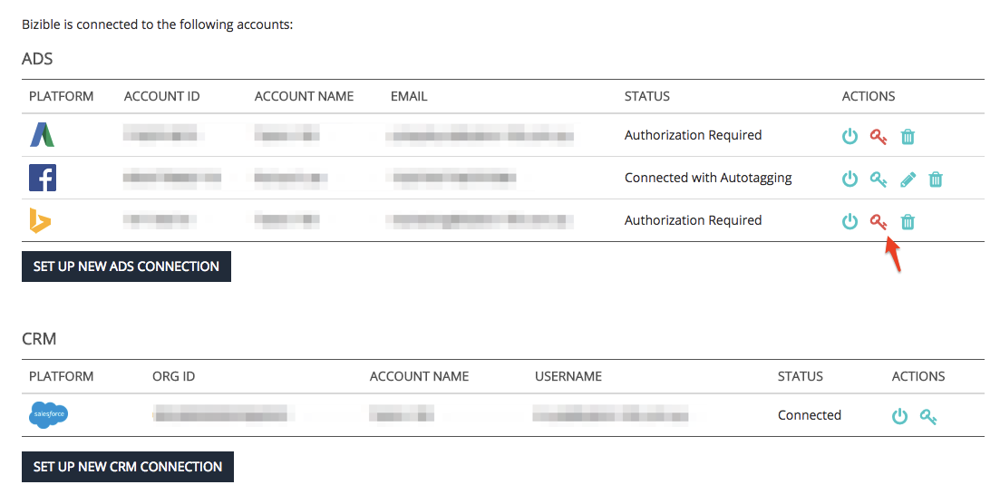

# Reauthorizing Connected Accounts {#reauthorizing-connected-accounts}

Reauthorizing Connected Accounts - Bizible - Product Documentation

When an account becomes disconnected from your Bizible account, the platform's status will change to 'Authorization Required' and display a red key icon.  
  
If your ad platform becomes disconnected, Bizible will not be able to download cost data or, if you have autotagging enabled, append the Bizible UTM parameters to any newly created ads. Bizible will not be able to retroactively append the UTM parameters to any touchpoints created from the ad platform while the account was disconnected.  
  
If your CRM platform becomes disconnected, Bizible will not be able to update Bizible data or push any new touchpoints into your org. Once the CRM connection has been re-established, Bizible will push any data that was missed while the account was disconnected. &nbsp;

#### Re-Authorizing Disconnected accounts {#reauthorizingconnectedaccounts-re-authorizingdisconnectedaccounts}

##### 1. Go to [apps.bizible.com](http://apps.bizible.com) and log-in. {#reauthorizingconnectedaccounts-gotoapps.bizible.comandlog-in.}

##### 2. Select Settings under the My Account tab in the top left corner. {#reauthorizingconnectedaccounts-selectsettingsunderthemyaccounttabinthetopleftcorner.}

##### 3. Find the Integrations section on the left, and select Connections. {#reauthorizingconnectedaccounts-findtheintegrationssectionontheleft-andselectconnections.}

##### 4. Select the Red Key symbol next to the account that needs to be reconnected. {#reauthorizingconnectedaccounts-selecttheredkeysymbolnexttotheaccountthatneedstobereconnected.}

##### 5. A pop-up window will appear, prompting you to provide the login in details for the account. {#reauthorizingconnectedaccounts-apop-upwindowwillappear-promptingyoutoprovidetheloginindetailsfortheaccount.}

