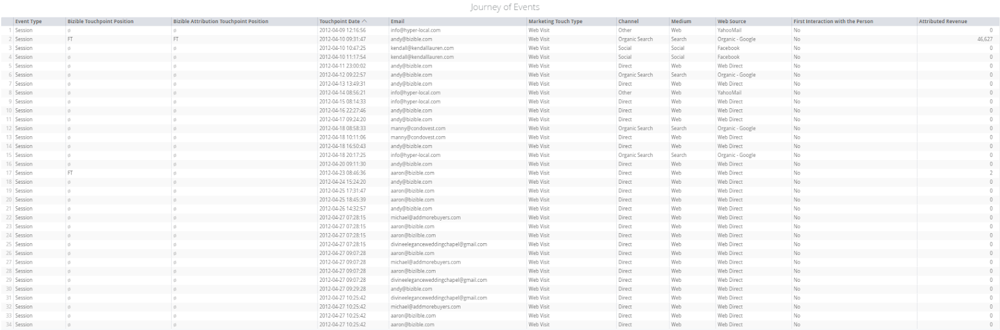

# Engagement Path {#engagement-path}

Engagement Path - Bizible - Product Documentation

Engagement Path allows you to see a complete view of lead, contact, account, and opportunity engagements from first touch all the way to close.

#### Tile Description {#engagementpath-tiledescription}

**Event Type:** The type of touchpoint (Session, CRM Campaign, CRM Event, CRM Task, Impression)

**Bizible Touchpoint Position:** Touchpoint Position of the lead/contact

**Bizible Attribution Touchpoint Position:** Bizible Attribution Touchpoint Position of the Opportunity

**Touchpoint Date:** For online sources: date & time the engagement occurred. For offline events: date & time set in the Salesforce Campaign. For activities touchpoint: touchpoint date field being referenced in the activities configuration

**Email:** The email associated to the engagement

**Marketing Touch Type:** Type of engagement(Web Visit, Web Form, Web Chat, CRM, Activity Types)

**Channel:** Marketing channel which drove the engagement

**Medium:** Medium of engagement

* If the engagement comes from an API connected platform (Adwords/BingAds) medium will be CPC
* If the engagement’s landing page contains utm_medium, we will parse
* If the engagement comes from CRM campaign, the medium comes from the ‘Type’ field from the CRM campaign

**Web Source:** This column will display the source of the engagement

* If the engagement comes from an API connected platform, web source will display the name of the ad platform
* If the touchpoint came from organic search, this field will display the name of the search engine
* If not #1 or #2, and the utm_source value is present in the landing page URL for the touchpoint, that value will be displayed here
* If not #1 or #2 and there is no utm_source value present, the root domain of the referring URL will be displayed here.
* If none of the above, this will display Web Direct or Web

**First Interaction with the Person:** This column will display Yes or No if that touchpoint was the individuals first interaction

**Attributed Revenue:** This column will display the revenue attributed to that touchpoint based on the selected attribution model selected

#### Filter Description {#engagementpath-filterdescription}

<table class="wrapped confluenceTable"> 
 <colgroup> 
  <col> 
  <col> 
 </colgroup> 
 <tbody> 
  <tr> 
   <th>Filter Name</th> 
   <th>Description</th> 
  </tr> 
  <tr> 
   <td>
Account Name/ID
</td> 
   <td>
Allows for multiple values by adding filters through the plus sign "+" on the right. Multiple filter values will have "either or" relationship, meaning tile will show results for both filter values. If any of the filter values are not valid, the dashboard will not produce results for the invalid value, but will still filter to the valid filter values. Not case sensitive.
</td> 
  </tr> 
  <tr> 
   <td>
Opportunity Name/ID
</td> 
   <td>
Allows for multiple values by adding filters through the plus sign "+" on the right. Multiple filter values will have "either or" relationship, meaning tile will show results for both filter values. If any of the filter values are not valid, the dashboard will not produce results for the invalid value, but will still filter to the valid filter values. Not case sensitive.
</td> 
  </tr> 
  <tr> 
   <td>
Lead ID/Email
</td> 
   <td>
Allows for multiple values by adding filters through the plus sign "+" on the right. Multiple filter values will have "either or" relationship, meaning tile will show results for both filter values. If any of the filter values are not valid, the dashboard will not produce results for the invalid value, but will still filter to the valid filter values. Not case sensitive.
</td> 
  </tr> 
  <tr> 
   <td>
Contact ID/Email
</td> 
   <td>
Allows for multiple values by adding filters through the plus sign "+" on the right. Multiple filter values will have "either or" relationship, meaning tile will show results for both filter values. If any of the filter values are not valid, the dashboard will not produce results for the invalid value, but will still filter to the valid filter values. Not case sensitive.

Account Name/ID, Lead ID/Email, Contact ID/Email filter are "either or" relationship, meaning if both lead filter and contact filter has value, it will show all records for either of the IDs.
</td> 
  </tr> 
  <tr> 
   <td>
Attribution Model
</td> 
   <td>
Specify which model the attributed revenue should be calculated against. Allowed values: "Full Path Attribution", "First Touch Attribution", "Custom Model Attribution", "Lead Creation Attribution", "U Shaped Attribution", "W Shaped Attribution".
</td> 
  </tr> 
  <tr> 
   <td>
Event Type
</td> 
   <td>
Filter journey by type of event the user touchpoint is based on. Allows for multiple values by adding filters through the plus sign "+" on the right. Allowed values: "Session", "CRM Campaign", "CRM Event", "CRM Task", "Impression".
</td> 
  </tr> 
  <tr> 
   <td>
Lead Stages
</td> 
   <td>
Filter journey by lead stage the user touchpoint is based on. Allows for multiple values by adding filters through the plus sign "+" on the right. Filter default to "is equal to" will show suggestions to choose from, but recommend using "contains" as filter criteria for multiple filters on stages.
</td> 
  </tr> 
  <tr> 
   <td>
Opportunity Stages
</td> 
   <td>
Filter journey by opportunity stage the user touchpoint is based on. Allows for multiple values by adding filters through the plus sign "+" on the right. Filter default to "is equal to" will show suggestions to choose from, but recommend using "contains" as filter criteria for multiple filters on stages.
</td> 
  </tr> 
  <tr> 
   <td>
Touchpoint Date
</td> 
   <td>
Filter journey by touchpoint date/time.
</td> 
  </tr> 
  <tr> 
   <td>
User Touchpoint Email
</td> 
   <td>
Filter journey by email on user touchpoint. This allows for filtering emails that are not associated with a lead/contact/account.
</td> 
  </tr> 
  <tr> 
   <td>
Marketing Touch Type
</td> 
   <td>
Filter journey by marketing touch type.
</td> 
  </tr> 
  <tr> 
   <td>
Channel
</td> 
   <td>
Filter journey by channel.
</td> 
  </tr> 
  <tr> 
   <td>
Medium
</td> 
   <td>
Filter journey by medium.
</td> 
  </tr> 
  <tr> 
   <td>
Web Source
</td> 
   <td>
Filter journey by web source.
</td> 
  </tr> 
  <tr> 
   <td>
First Interaction with the Person
</td> 
   <td>
Filter journey by "Is First Touch" column on user touchpoints table.
</td> 
  </tr> 
  <tr> 
   <td>
Attributed Revenue
</td> 
   <td>
Filter journey by attributed revenue value.
</td> 
  </tr> 
 </tbody> 
</table>

