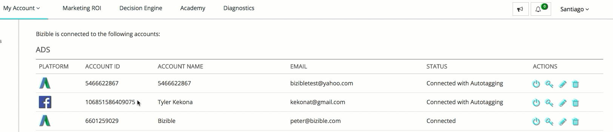

# Facebook API {#facebook-api}

Facebook API - Bizible - Product Documentation

### What's in this article? {#what-s-in-this-article}

[Introduction](#facebookapi-introduction)  
[How to Configure the Facebook Integration](#facebookapi-howtoconfigurethefacebookintegration)  
[Connecting the Account](#facebookapi-connectingtheaccount)  
[Enabling Autotagging](#facebookapi-enablingautotagging)  
[Field Mapping](#facebookapi-fieldmapping)  
[FAQ](#facebookapi-faq)

#### Introduction   
{#facebookapi-introduction}

Similar to our AdWords & Bing Ads integrations, our Facebook integration does two fundamental actions:

* `Auto-tag all Facebook Ads with a Bizible parameter (_bf)`
* `Download ad cost information across all active Facebook ads`

#### How to Configure the Facebook Integration {#facebookapi-howtoconfigurethefacebookintegration}

As for setup, there are seven steps to be completed within Bizible's app.

##### 1. Navigate to [apps.bizible.com](http://apps.bizible.com) and log-in. {#facebookapi-navigatetoapps.bizible.comandlog-in.}

##### 2. UnderMy AccountselectSettings. {#facebookapi-undermyaccountselectsettings.}

##### 3. Under Integrations selectConnections. {#facebookapi-underintegrationsselectconnections.}

##### 4. SelectSet Up New Ads Connection, and a pop-up will appear. Select Facebook and log-in using your Facebook credentials.  {#facebookapi-selectsetupnewadsconnection-andapop-upwillappear.selectfacebookandlog-inusingyourfacebookcredentials.}

>[!NOTE]
>
>The person connecting the Facebook Ads account needs to be an admin within the Facebook Ads account.

##### 5. Once Bizible is connected to your Facebook account, click the pencil icon next to the account. {#facebookapi-oncebizibleisconnectedtoyourfacebookaccount-clickthepenciliconnexttotheaccount.}

##### 6. Within this view, move the 'Auto-tagging?' toggle to 'Yes.' Then select the check box found in the Learn More section to agree to the terms and conditions. Make sure the Auto-tagging toggle is still set to 'Yes'. {#facebookapi-withinthisview-movethe'auto-tagging?'toggleto'yes.'thenselectthecheckboxfoundinthelearnmoresectiontoagreetothetermsandconditions.makesuretheauto-taggingtoggleisstillsetto'yes'.}

#### Connecting the Account {#facebookapi-connectingtheaccount}

#### Enabling Autotagging {#facebookapi-enablingautotagging}

>[!NOTE]
>
>`If you enable auto-tagging, we'll reset the conversion history and social proof of all of the ads that we tag. We highly recommend` [exporting this data as a CSV](http://www.facebook.com/business/help/205067636197240) before you enable auto-tagging.

Once you've enabled the integration, Bizible will start downloading ad level cost into the Bizible Marketing ROI Dashboard.

For the integration to properly work, you'll need to enable auto-tagging on your Facebook account. This will allow our system to add a _bf parameter across all ad links. This process will add the new parameter on top of any other tracking parameters you've already added to your Facebook ads.

#### Field Mapping {#facebookapi-fieldmapping}

<table class="confluenceTable"> 
 <colgroup> 
  <col> 
  <col> 
 </colgroup> 
 <tbody> 
  <tr> 
   <th>
<strong>Touchpoint Field</strong>
</th> 
   <th>
<strong>Value</strong>
</th> 
  </tr> 
  <tr> 
   <td>
Ad Campaign Id
</td> 
   <td>
[Facebook Campaign Id]
</td> 
  </tr> 
  <tr> 
   <td>
Ad Campaign Name 
</td> 
   <td>
[Facebook Campaign Name], or [utm_campaign] if provided
</td> 
  </tr> 
  <tr> 
   <td>
Ad Group Id
</td> 
   <td>
[Facebook Ad Set Id]
</td> 
  </tr> 
  <tr> 
   <td>
Ad Group Name
</td> 
   <td>
[Facebook Ad Set Name]
</td> 
  </tr> 
  <tr> 
   <td>
Touchpoint Source
</td> 
   <td>
“Facebook”, or [utm_source] if provided
</td> 
  </tr> 
  <tr> 
   <td>
Medium
</td> 
   <td>
“Social”, or [utm_medium] if provided
</td> 
  </tr> 
  <tr> 
   <td>
Ad Id, or Creative_Unique_Id (Data Warehouse)
</td> 
   <td>
[custom Id generated from utm_content]
</td> 
  </tr> 
  <tr> 
   <td>
Ad Content, or Creative_Name (Data Warehouse)
</td> 
   <td>
[utm_content] if provided
</td> 
  </tr> 
  <tr> 
   <td>
Keyword Text, or Keyword_Name (Data Warehouse)
</td> 
   <td>
[utm_term] if provided
</td> 
  </tr> 
  <tr> 
   <td>
Ad_Unique_Id (Data Warehouse)
</td> 
   <td>
[Facebook Ad Id]
</td> 
  </tr> 
  <tr> 
   <td>
Ad_Name (Data Warehouse)
</td> 
   <td>
[Facebook Ad Name]
</td> 
  </tr> 
  <tr> 
   <td>
Keyword_Unique_Id (Data Warehouse)
</td> 
   <td>
[custom Id generated from utm_term]
</td> 
  </tr> 
  <tr> 
   <td>
Ad_Provider (Data Warehouse)
</td> 
   <td>
“Facebook”
</td> 
  </tr> 
  <tr> 
   <td>
Account_Unique_ID (Data Warehouse)
</td> 
   <td>
[Facebook Account #]
</td> 
  </tr> 
  <tr> 
   <td>
Account_Name (Data Warehouse)
</td> 
   <td>
[Facebook Account Name]
</td> 
  </tr> 
 </tbody> 
</table>

#### FAQ   
{#facebookapi-faq}

##### Q: What Facebook Ads are supported by Bizible?  {#facebookapi-q-whatfacebookadsaresupportedbybizible?}

A: Carousel, Single Image. Not Video, Slideshow or Collection at this time.

##### Q: What is social proof?  {#facebookapi-q-whatissocialproof?}

A: Social proof is visible engagement such as likes, clicks, comments, and shares.

##### Q: What happens when Bizible tags the Ad?  {#facebookapi-q-whathappenswhenbizibletagsthead?}

A: Facebook does not allow ads to be edited so Bizible needs to delete the creative, which contains the Destination URL, and then re-create the ad with the new parameters.

##### Q: Why does Bizible update all Facebook Ads? {#facebookapi-q-whydoesbizibleupdateallfacebookads?}

A: Bizible's process is to tag all ads in case they are re-activated.

##### Q: What permission does the connected user need?  {#facebookapi-q-whatpermissiondoestheconnecteduserneed?}

A: ads_management, email

##### Q: How long can it take to import spend data?  {#facebookapi-q-howlongcanittaketoimportspenddata?}

A: 1 hour

##### Q: How long can it take to import ad data?  {#facebookapi-q-howlongcanittaketoimportaddata?}

A: 4 hours
