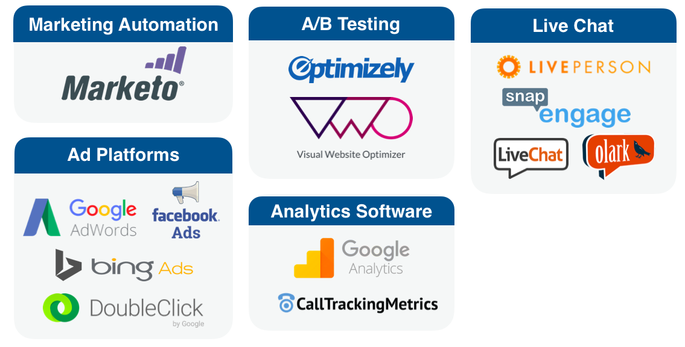

# Bizible Framework {#bizible-framework}

Bizible Framework - Bizible - Product Documentation

Learn more about the four main components that make up the Bizible framework. Bizible relies on these applications to track, organize, and house data, as well as provide reporting capabilities. The four components that comprise Bizible’s framework are:

* Bizible’s JavaScript
* CRM Integrations
* Third Party Applications/Systems
* Bizible Application

#### Bizible JavaScript {#bizibleframework-biziblejavascript}

The Bizible JavaScript tracks all the online marketing interactions, also called touchpoints, that prospects/leads have with your organization. It is a custom script that is added before the closing </head> tag on every page of your website. &nbsp;

**

>[!NOTE]
>
>For instructions on how to add the Bizible JS, please [click here](http://docs.marketo.com/x/qwEgAQ).

Bizible’s JS captures data from web visits (including anonymous web visits), general traffic/page navigation, content downloads, and form submissions. This data is pushed into your CRM and each marketing interaction is displayed as a touchpoint.

#### CRM Integrations {#bizibleframework-crmintegrations}

Bizible integrates with CRMs to house and organize all the data that is captured by the Bizible JS. Currently, Bizible has API integrations with two CRMs:

By surfacing Bizible data in your CRM, you will be able to see the granular information related to each touchpoint and generate reports to understand how your channels are performing.

#### Third-Party Applications {#bizibleframework-third-partyapplications}

Most marketers rely on a few different applications to run their marketing efforts. In addition to Salesforce and MS Dynamics, Bizible is integrated with 13 third-party applications (listed below).

If you are running any marketing efforts using the applications above, you can link those accounts to your Bizible account. This allows easy tracking and transfer of data to your Bizible account.

#### Bizible Application {#bizibleframework-bizibleapplication}

The Bizible application is used to view and report on your attribution data, configure account settings, and update account information. The main menu items in the Bizible app include:  
  
**Account Configuration** 
  
This is where you can update your company’s general information and access the Bizible Javascript.   
  
**Settings** 
  
This menu item allows you to configure your attribution and channel mapping settings, manage integrations with CRMs and third-party applications, view/add Bizible account users, and update billing information.  
  
**Marketing ROI Dashboard** 
  
The Marketing ROI Dashboard menu item is where you can visualize your data in terms of channel performance, activity and cost.
