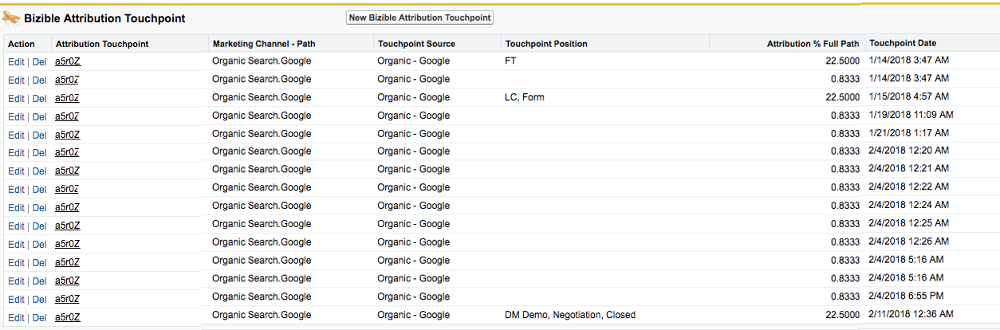

# Why You Should Never Delete Touchpoints {#why-you-should-never-delete-touchpoints}

Why You Should Never Delete Touchpoints - Bizible - Product Documentation

If you find that there is a touchpoint on an Opportunity that is being assigned attribution credit incorrectly, please reach out to your Account Manager to determine next steps. In these situations, we recommend using Bizible's touchpoint suppression feature to remove the touchpoint from SFDC and the ROI dashboard. Your account manager can help create these rules. Please do not manually delete these touchpoints yourself.&nbsp;

Bizible's processing system will not register that a touchpoint has been manually deleted from SFDC. As of today, there is no trigger that signals to our system to adjust data. Bizible will not automatically push another touchpoint to replace the one that was deleted, nor will it reassign the touchpoint position or attribution to the subsequent touchpoint.&nbsp;

When a touchpoint is deleted, it creates a hole in the attribution data. Typically, this will manifest in the attribution touchpoints on an Opportunity. In the image below, the touchpoint that would have received the Opportunity Creation touch had been deleted. As a result, this opportunity is missing the OC touchpoint and the attribution percentage for this Opp will not add up to 100%.

`If touchpoints have been deleted from your SFDC, please reach out to` [ `[email protected]`](http://docs.marketo.com/cdn-cgi/l/email-protection#c8bbbdb8b8a7babc88aaa1b2a1aaa4ade6aba7a5) `to request a reimport of your data.`
